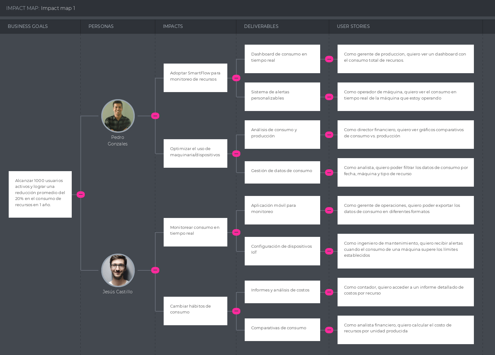
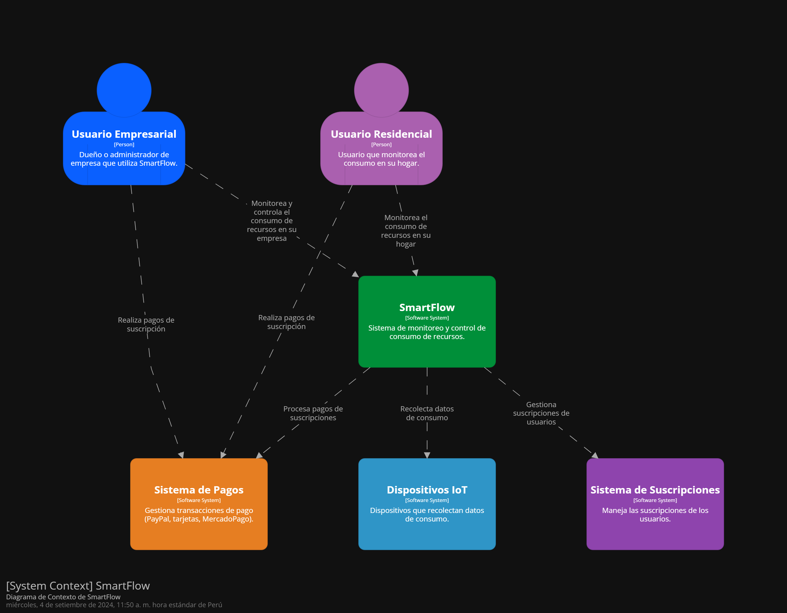
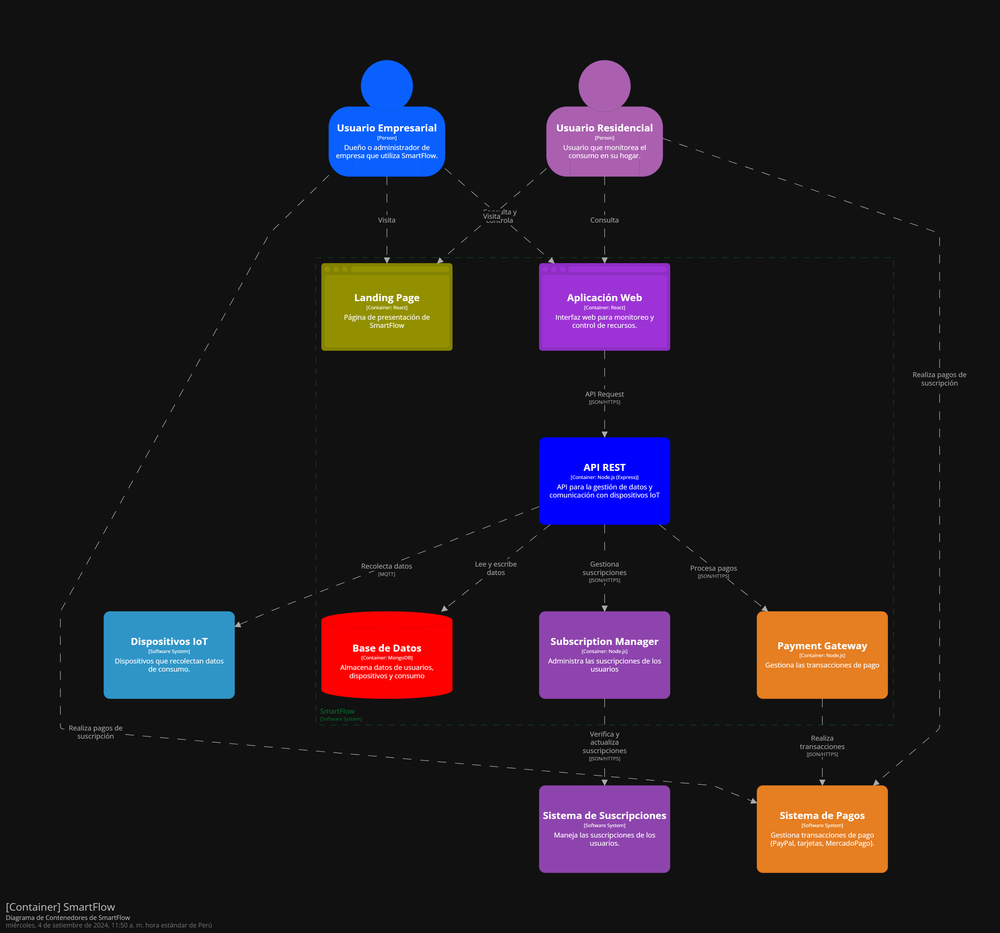
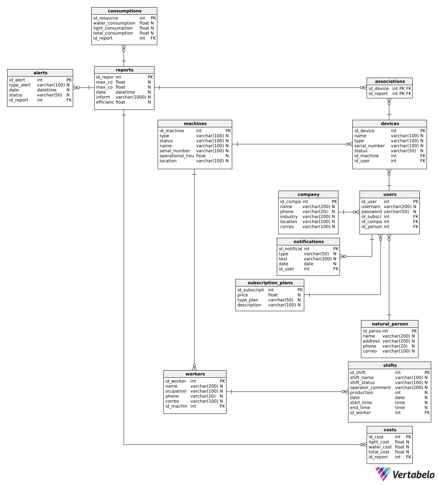

<div align="center">

<h1 style="text-align: center;"> Informe del Trabajo Final </h1>
<h3 style="text-align: center;"> Universidad Peruana de Ciencias Aplicadas </h3>


<h5 style="text-align: center">UNIVERSIDAD PERUANA DE CIENCIAS APLICADAS</h5>

<h5 style="text-align: center">CARRERA</h5>
<p style="text-align: center">Ingeniería de Software y Ciencias de la Computación
</p>

<h5 style="text-align: center">CICLO</h5>
<p style="text-align: center">2024-02</p>

<h5 style="text-align: center">CURSO</h5>
<p style="text-align: center">Open Source</p>

<h5 style="text-align: center">SECCIÓN</h5>
<p style="text-align: center">SW57</p>

<h5 style="text-align: center">DOCENTE</h5>
<p style="text-align: center">Angel Augusto Velasquez Nuñez
</p>

<h5 style="text-align: center">Grupo</h5>
<p style="text-align: center">PeSoftware</p>

<h5 style="text-align: center">PRODUCTO</h5>
<p style="text-align: center">SmartFlow</p>

<h5 style="text-align: center">AGOSTO, 2024</h5>

</div>

## Team members:
| Nombre |Código|
|:-------:|:----------:|
|Quiñones Tintaya, Johan Jorge|U202218183|
|Gongora Castillejos,Williams Jesus|U20221C186|
|Carlos Andres, Leon Rioja|U202111451|
|Revilla Quispe, Renzo Zamir|U201717085|
|Lopez de la Cruz Mauro Fabricio|U202215695|

</br></br>

## Registro de versiones del informe


|Versión|Fecha|Autor|Descripción de modificación|
|:-:|:-:|:-:|:-:|
|TB1|08/09/2024|Gongora Castillejos, Williams Jesus</br></br>Quiñones Tintaya, Johan Jorge</br></br>Carlos Andres, Leon Rioja</br></br>Revilla Quispe, Renzo Zamir</br></br> opez de la Cruz Mauro Fabricio|Creación del documento de trabajo en formato markdown, capítulo I, capítulo II, capítulo III, capítulo IV y capítulo V    |
|TP1|27/09/2024|Gongora Castillejos, Williams Jesus</br></br>Quiñones Tintaya, Johan Jorge</br></br>Carlos Andres, Leon Rioja</br></br>Revilla Quispe, Renzo Zamir</br></br> opez de la Cruz Mauro Fabricio|Correccion de errores e Implementación de todo el Sprint 2 |

</br></br>

## Project Report Collaboration Insights


Enlace de la organización para el reporte del proyecto: https://github.com/PeSoftwareUPC

**TB1**

Para el desarrollo del informe correspondiente a la entrega TB1, se estableció la implementación de secciones de la siguiente manera para cada integrante del equipo:

|Integrante|Tareas Asignadas|
|-|-|
|Williams Gongora Castilejos|Capitulo I, Antecedentes y problemática 5W y 2H, Segmentos Objetivos,, Needfinding, User Personas, User Task Matrix, User Journey Mapping, Empathy Mapping, Database Design, Database Diagram, Sprint 1, Sprint 2|
Johan Jorge Quiñones Tintaya| Domain Driven Design Architecture, Context Diagram, Container Diagram, Components Diagram, Software Configuration Managment, Entrevistas, Analisis de entrevistas, Sprint 1. |
|Lopez de la Cruz Mauro Fabricio|Competidores ,Mejoramiento del informe, Software Development Environment Configuration,Source Code Management,creacion del componente dashboard, creacion de la parte bashboard en la aplicacion web|
|Renzo Zamir Revilla Quispe|Organizations Systems, Labeling Systems, SEO Tags and Meta Tags, Searching Systems, Navigation Systems, Class Diagrams, Class Dictionary|
|Carlos Andres Leon Rioja|Web Applications UX/UI Design, Web Applications Wireframes, Web Applications Wireflow Diagrams, Web Applications Mock-ups, Web Applications User FLow Diagrams, Web Applications Prototyping y Domain-Driven Software Architecture|

El proceso de colaboración en el informe se realizó mediante commits constantes al repositorio de la organización.

</br>

## **Github Collaboration Insights**

Todas las ramas se crearon siguiendo la metodología GitFlow, que garantiza una organización estructurada y eficiente del código. GitFlow facilita la colaboración en proyectos al establecer un flujo de trabajo estandarizado para el desarrollo, con ramas específicas para nuevas funcionalidades, corrección de errores y preparación de lanzamientos, asegurando un control de versiones más ordenado y predecible.

GitHub también proporciona una visualización detallada del historial de las ramas principales, destacando los procesos de merge realizados.


Los integrantes son:

* Williams Gongora (WiJeGo)
* Quiñones Tintaya (johaanq)
* Fabricio Lopez (lopezFABRAX)
* Renzo Zamir Revilla Quispe (renzorevq24)
* Carlos Andres Leon Rioja (Sr-Anonymus-maker)

(**Especifiquen los usuarios**)

Se explican las ramas más prominentes:

**main:**  es la rama principal del proyecto y se actualiza con cada entregable.

**develop:**  es la rama principal para el desarrollo continuo del proyecto.

**feature**: contiene los cambios constantes realizados por los artefactos relacionados con el sprint del informe.

**TB1 y TP1**

<br>


*Imagen: Evidencia Github Collaboration*

<br>


*Imagen: Evidencia Github Collaboration*

<br>


*Imagen: Evidencia Github Collaboration*

<br>


*Imagen: Evidencia Github Collaboration*

<br>


## Contenido

[**Capítulo I: Introducción.**](#1) <br>
    1.1. [Startup Profile](#11) <br>
    &emsp;1.1.1. [Descripción de la Startup](#111) <br>
    &emsp;1.1.2. [Perfiles de integrantes del equipo](#112) <br>
   1.2. [Solution Profile](#12) <br>
   &emsp;1.2.1. [Antecedentes y problemática](#121) <br>
   &emsp;1.2.2. [Lean UX Process](#122) <br>
   &emsp;&emsp;1.2.2.1. [Lean UX Problem Statements](#1221) <br>
   &emsp;&emsp;1.2.2.2. [Lean UX Assumptions](#1222) <br>
   &emsp;&emsp;1.2.2.3. [Lean UX Hypothesis Statements](#1223) <br>
   &emsp;&emsp;1.2.2.4. [Lean UX Canvas](#1224) <br>
   1.3. [Segmentos objetivo](#13) <br>

[**Capítulo II: Requirements Elicitation & Analysis.**](#2) <br>
   2.1. [Competidores](#21) <br>
   &emsp;2.1.1. [Análisis competitivo](#211) <br>
   &emsp;2.1.2. [Estrategias y tácticas frente a competidores](#212) <br>
   2.2. [Entrevistas](#22) <br>
   &emsp;2.2.1. [Diseño de entrevistas](#221) <br>
   &emsp;2.2.2. [Registro de entrevistas](#222) <br>
   &emsp;2.2.3. [Análisis de entrevistas](#223) <br>
   2.3. [Needfinding](#23) <br>
   &emsp;2.3.1. [User Personas](#231) <br>
   &emsp;2.3.2. [User Task Matrix](#232) <br>
   &emsp;2.3.3. [User Journey Mapping](#233) <br>
   &emsp;2.3.4. [Empathy Mapping](#234) <br>
   &emsp;2.3.5. [As-is Scenario Mapping](#235) <br>
   2.4. [Ubiquitous Language](#24) <br>

[**Capítulo III: Requirements Specification.**](#3) <br>
   3.1. [To-Be Scenario Mapping](#31) <br>
   3.2. [User Stories](#32) <br>
   3.3. [Impact Mapping](#33) <br>
   3.4. [Product Backlog](#34) <br>

[**Capítulo IV: Product Design.**](#4) <br>
   4.1. [Style Guidelines](#41) <br>
   &emsp;4.1.1. [General Style Guidelines](#411) <br>
   &emsp;4.1.2. [Web Style Guidelines](#412) <br>
   4.2. [Information Architecture](#42) <br>
   &emsp;4.2.1. [Organization Systems](#421) <br>
   &emsp;4.2.2. [Labeling Systems](#422) <br>
   &emsp;4.2.3. [SEO Tags and Meta Tags](#423) <br>
   &emsp;4.2.4. [Searching Systems](#424) <br>
   &emsp;4.2.5. [Navigation Systems](#425) <br>
   4.3. [Landing Page UI Design](#43) <br>
   &emsp;4.3.1. [Landing Page Wireframe](#431) <br>
   &emsp;4.3.2. [Landing Page Mock-up](#432) <br>
   4.4. [Web Applications UX/UI Design](#44) <br>
   &emsp;4.4.1. [Web Applications Wireframes](#441) <br>
   &emsp;4.4.2. [Web Applications Wireflow Diagrams](#442) <br>
   &emsp;4.4.3. [Web Applications Mock-ups](#443) <br>
   &emsp;4.4.4. [Web Applications User Flow Diagrams](#444) <br>
   4.5. [Web Applications Prototyping](#45) <br>
   4.6. [Domain-Driven Software Architecture](#46) <br>
   &emsp;4.6.1. [Software Architecture Context Diagram](#461) <br>
   &emsp;4.6.2. [Software Architecture Container Diagrams](#462) <br>
   &emsp;4.6.3. [Software Architecture Components Diagrams](#463) <br>
   4.7. [Software Object-Oriented Design](#47) <br>
   &emsp;4.7.1. [Class Diagrams](#471) <br>
   &emsp;4.7.2. [Class Dictionary](#472) <br>
   4.8. [Database Design](#48) <br>
   &emsp;4.8.1. [Database Diagram](#481) <br>

[**Capítulo V: Product Implementation, Validation & Deployment.**](#5) <br>
   5.1. [Software Configuration Management](#51) <br>
   &emsp;5.1.1. [Software Development Environment Configuration](#511) <br>
   &emsp;5.1.2. [Source Code Management](#512) <br>
   &emsp;5.1.3. [Source Code Style Guide & Conventions](#513) <br>
   &emsp;5.1.4. [Software Deployment Configuration](#514) <br>
   5.2. [Landing Page, Services & Applications Implementation](#52) <br>
   &emsp;5.2.1. [Sprint 1](#521) <br>
   &emsp;&emsp;5.2.1.1. [Sprint Planning 1](#5211) <br>
   &emsp;&emsp;5.2.1.2. [Sprint Backlog 1](#5212) <br>
   &emsp;&emsp;5.2.1.3. [Development Evidence for Sprint Review](#5213) <br>
   &emsp;&emsp;5.2.1.4. [Testing Suite Evidence for Sprint Review](#5214) <br>
   &emsp;&emsp;5.2.1.5. [Execution Evidence for Sprint Review](#5215) <br>
   &emsp;&emsp;5.2.1.6. [Services Documentation Evidence for Sprint Review](#5216) <br>
   &emsp;&emsp;5.2.1.7. [Software Deployment Evidence for Sprint Review](#5217) <br>
   &emsp;&emsp;5.2.1.8. [Team Collaboration Insights during Sprint](#5218) <br>
   
   &emsp;5.2.2. [Sprint 2](#522) <br>
   &emsp;&emsp;5.2.2.1. [Sprint Planning 2](#5221) <br>
   &emsp;&emsp;5.2.2.2. [Sprint Backlog 2](#5222) <br>
   &emsp;&emsp;5.2.2.3. [Development Evidence for Sprint Review](#5223) <br>
   &emsp;&emsp;5.2.2.4. [Testing Suite Evidence for Sprint Review](#5224) <br>
   &emsp;&emsp;5.2.2.5. [Execution Evidence for Sprint Review](#5225) <br>
   &emsp;&emsp;5.2.2.6. [Services Documentation Evidence for Sprint Review](#5226) <br>
   &emsp;&emsp;5.2.2.7. [Software Deployment Evidence for Sprint Review](#5227) <br>
   &emsp;&emsp;5.2.2.8. [Team Collaboration Insights during Sprint](#5228)
   

6. [**Conclusiones**](#conclusiones)

7. [**Bibliografía**](#bibliografia)

8. [**Anexo**](#anexo)

&emsp; 8.1. [Anexo N°1: Número de clientes finales por sectores](#anexo1)
</br></br></br>


## Student Outcome
El curso contribuye al cumplimiento del Student Outcome ABET:</br> 
**ABET – EAC - Student Outcome 3**

**Criterio:** Capacidad de comunicarse efectivamente con un rango de audiencias. En el siguiente cuadro se describen las acciones realizadas y enunciados de conclusiones por parte del grupo, que permiten sustentar el haber alcanzado el logro del ABET – EAC - Student Outcome 3.

</br>

| **Criterio específico**| **Acciones realizadas**| **Conclusiones**|
|--|--|--|
| Comunica oralmente con efectividad a diferentes rangos de audiencia. | **Gongora Castillejos, Williams**<br>**TB1:** Durante la presentación de la problemática y la solución SmartFlow en la reunión del equipo, expuse claramente el perfil de la startup, los antecedentes y la propuesta técnica.<br>**TP1:** En esta entrega, detallé las capacidades y funcionalidades que nuestra aplicación web incluirá, además de ajustar aún más el alcance de su implementación. También establecí claramente los pasos a seguir para corroborar la evidencia y dar seguimiento al Sprint 2, asegurando un proceso organizado y enfocado en los objetivos establecidos.<br><br>**Quiñones Tintaya, Johan Jorge**<br>**TB1:** Presentó el To-Be Scenario Mapping, User Stories, e Impact Mapping.<br>**TP1:**<br>Para esta entrega realice el front end y deploy de la pagina web, por parte del front end, realice worker-deatails.component, dashboard.component, side-navigations-bar y agregue los routes para la pagina, por parte de del deploy se realizo con gh-pages.<br>**Carlos Andres, Leon Rioja**<br>**TB1:** Expuso sobre la Information Architecture y el Landing Page UI Design.<br>**TB1:** Expuso sobre Problem Statement y el User Persona.<br><br>**Revilla Quispe, Renzo Zamir**<br>**TB1:** Presentó el análisis comparativo de Web Applications UX/UI Design.<br><br>**Lopez de la Cruz Mauro Fabricio**<br>**TB1:** Comunicó las User Personas y el User Journey Mapping. <br>**TP1:**  Para esta entrega, me encargué de la parte del frontend, específicamente del desarrollo y presentación del dashboard de la aplicación web. Expuse cómo las funcionalidades permiten a los usuarios monitorear el consumo de energía y agua en tiempo real, destacando la simplicidad de la interfaz.<br>| **Gongora Castillejos, Williams:** Expuse el perfil de la startup y la propuesta técnica, estableciendo una base clara para el equipo. Esto facilitó una comprensión común sobre el enfoque del proyecto y sus objetivos.<br><br>**Quiñones Tintaya, Johan Jorge:** Presenté el To-Be Scenario Mapping y User Stories, proporcionando una visión de cómo se desarrollará el proyecto y las necesidades de los usuarios.<br><br>**Carlos Andres, Leon Rioja:** Expuse la arquitectura de información y el diseño UI de la landing page, clarificando la estructura y el diseño del producto.<br><br>**Revilla Quispe, Renzo Zamir:** Presenté un análisis comparativo de diseños UX/UI, proporcionando información valiosa sobre las mejores prácticas y estándares de la industria.<br><br>**Lopez de la Cruz Mauro Fabricio:** Comunicó las User Personas y el User Journey Mapping, ayudando a entender mejor las necesidades y experiencias de los usuarios objetivo. |
| Comunica por escrito con efectividad a diferentes rangos de audiencia | **Gongora Castillejos, Williams**<br>**TB1:** Redacté el Capítulo I del informe, que incluye los antecedentes, la problemática y el diseño de la base de datos. También incluí pautas para las tareas en el sprint 1.<br>**TP1:** En esta entrega, presenté de manera clara y detallada las capacidades y funcionalidades que tendrá nuestra aplicación web, ajustando también el alcance de su implementación para alinearlo con las necesidades del proyecto. Adicionalmente, delineé los pasos a seguir para verificar la evidencia y dar seguimiento al Sprint 2, asegurando que todas las partes involucradas comprendan el proceso y los próximos pasos, independientemente de su nivel de experiencia técnica.<br><br>**Quiñones Tintaya, Johan Jorge**<br>**TB1:** Documenté el Product Backlog y el Domain-Driven Software Architecture.<br><br>**Carlos Andres, Leon Rioja**<br>**TB1:** Elaboré la documentación del Landing Page Wireframe y Mock-up.<br>**TP:** Cambie y mejore la documentación del Landing Page Wireframe y Mock-up.<br><br>**Revilla Quispe, Renzo Zamir**<br>**TB1:** Redacté el análisis de competidores y el Class Diagram.<br><br>**Lopez de la Cruz Mauro Fabricio**<br>**TB1:** Documenté el User Task Matrix, Empathy Mapping, y As-is Scenario Mapping.  <br>**TP1:**  En esta entrega, redacté un informe que detalla el desarrollo del dashboard de SmartFlow, enfocándome en cómo los datos de consumo energético y de agua son representados visualmente. Incluí explicaciones técnicas sobre la implementación de los gráficos y las APIs utilizadas, al mismo tiempo que brindé un resumen accesible para el equipo no técnico, destacando los beneficios de las funcionalidades añadidas.<br>| **Gongora Castillejos, Williams:** Mi redacción del Capítulo I proporcionó una base sólida para el informe, estableciendo el contexto del proyecto y las directrices para el trabajo futuro.<br><br>**Quiñones Tintaya, Johan Jorge:** La documentación del Product Backlog y la arquitectura del software organizó las tareas y definió la base técnica del proyecto, facilitando su planificación y ejecución.<br><br>**Carlos Andres, Leon Rioja:** La documentación del wireframe y mock-up de la landing page ayudó a visualizar el diseño del producto, asegurando que el equipo y los stakeholders comprendieran claramente su apariencia y funcionalidad.<br><br>**Revilla Quispe, Renzo Zamir:** Mi análisis de competidores y el diagrama de clases proporcionaron una visión detallada del mercado y la estructura del software, ayudando a posicionar el producto de manera efectiva.<br><br>**Lopez de la Cruz Mauro Fabricio:** La documentación del User Task Matrix, Empathy Mapping y As-is Scenario Mapping facilitó una comprensión profunda de las necesidades y comportamientos de los usuarios, mejorando el enfoque del proyecto en sus necesidades reales. |


<br>


<div id="1"><h1>Capítulo I: Introducción</h1></div>
<div id="11"><h2>1.1. Startup Profile</h2></div>
<div id="111"><h3>1.1.1. Descripción de la Startup</h3></div>

En PeSoftware, nos dedicamos a crear soluciones que permiten el control y monitoreo en tiempo real del consumo de recursos como luz y agua mediante nuestra aplicación SmartFlow. Nos enfocamos en ofrecer herramientas tecnológicas accesibles para que tanto empresas como individuos optimicen sus recursos, reduzcan costos y promuevan la sostenibilidad en sus actividades diarias.

**Misión:** Brindar tecnologías avanzadas que permitan a empresas y personas monitorear y controlar sus recursos de manera eficiente, reduciendo costos y operando de forma sostenible.

**Visión:** Ser la plataforma líder a nivel global en la optimización del consumo de recursos, impulsando una gestión eficiente y sostenible en todos los sectores.


<div id="111"><h3>1.1.2. Perfiles de integrantes del equipo</h3></div>

|Descripción del integrante|Perfil del integrante del equipo|
| :--------| :--------:|
| Mi nombre es **Johan Jorge Quiñones Tintaya**, tengo 19 años y soy estudiante de ingeniería de software en la UPC, cursando el quinto ciclo. He adquirido una base sólida en algoritmos y programación orientada a objetos, lo que me permite enfrentar desafíos de desarrollo con eficacia. Además, me destaco por mi capacidad para trabajar en equipo, manteniendo una comunicación clara y efectiva que facilita la colaboración. Estoy comprometido con mi crecimiento profesional y busco constantemente mejorar mis habilidades para contribuir de manera significativa en proyectos y equipos, ofreciendo soluciones innovadoras. | |
| Mi nombre es **Williams Jesús Góngora Castillejos** y soy estudiante del quinto ciclo de la carrera de Ingeniería de Software. Me considero una persona inteligente en todo lo que conlleva a números y razonamiento intuitivo, además de ser creativo para generar soluciones como ingeniero. Cuento con conocimientos en SQL, C++ y Python. Dentro de mis habilidades interpersonales, soy amable, empático y trato de establecer confianza entre mis compañeros para realizar un mejor trabajo en equipo. ||
| Mi nombre es **Renzo Zamir Revilla Quispe**, estudiante de la carrera de Ingenieria de Software, quinto ciclo. Cuento con un amplio conociemiento en programacion full stack y buena logica. En cuanto a mis habilidades blandas, soy bastante tolerante y me agrada el trabajo en equipo. Busco un buen desarrollo profesional en conjunto con el equipo de trabajo. ||
|Mi nombre es **Carlos Andres Leon Rioja**, actualmente tengo 21 años y soy estudiante de la carrera de Ingenieria de Software en la UPC. Considero que soy una persona con paciencia, amable y positiva sin embargo aveces soy obstinado y terco. Soy bueno en programacion full stack y se lenguajes como C++, C#, Java y Phython. Busco obtener mas conocimiento y habilidades para desarrollarme como programador full stack.||
|Mi nombre es **Mauro Fabricio Lopez de la Cruz**, tengo 19 años y soy estudiante de la carrera ingeneria de software de la UPC y actualmente estoy cursando el quito ciclo . Tengo conocomiento en c++ , python, html ,css, javascript. Me considero una persona amable con capacidad de tener una muy buena comunnicacion en trabajos en grupo para el desarrollo de proyectos dando y ayudando en la solucion de problemas .||


<div id="12"><h3>1.2. Solution Profile</h3></div>

<div id="121"><h3>1.2.1. Antecedenetes y problemática</h3></div>

* **What (Qué):**
SmartFlow se enfoca en desarrollar un sistema que permita monitorear y controlar en tiempo real el uso de recursos como electricidad y agua. Este sistema está diseñado tanto para particulares como para empresas, con el objetivo de optimizar la utilización de estos recursos, disminuir costos y fomentar la sostenibilidad.

* **Where (Dónde):**
La problemática se manifiesta principalmente en entornos industriales, como talleres y fábricas, donde las maquinarias consumen grandes cantidades de recursos como luz y agua. Además, SmartFlow es aplicable en hogares y pequeñas empresas que buscan una gestión más eficiente de sus recursos para reducir gastos.

* **When (Cuándo):**
La necesidad de un sistema como SmartFlow es continua, debido al creciente énfasis en aumentar la producción y la presión por disminuir los costos operativos en los últimos años(McKinsey Company, 2022). La demanda de soluciones para el monitoreo y control se ha intensificado a medida que empresas y usuarios buscan operar de manera más eficiente y sostenible(Squair, 2023).

* **Who (Quién):**
Los más afectados por esta situación son tanto los usuarios que carecen de herramientas efectivas para controlar su consumo de recursos en tiempo real, como las empresas que enfrentan desafíos para gestionar adecuadamente el uso de recursos y la producción en sus operaciones.

* **Why (Por qué):**
La principal razón de la necesidad de este proyecto radica en la falta de un sistema que sea eficiente y accesible para medir y gestionar el consumo de recursos en tiempo real. La mala gestión de estos recursos resulta en altos costos operativos y un uso ineficiente, afectando la competitividad y sostenibilidad tanto de empresas como de hogares.

* **How (Cómo):**
SmartFlow ofrece una solución que utiliza dispositivos IoT instalados en las entradas de electricidad y agua de las máquinas o sistemas de consumo. Estos dispositivos recogen datos en tiempo real, permitiendo a los usuarios monitorear, gestionar y optimizar su consumo mediante una aplicación web y móvil. Además, la plataforma emite alertas sobre irregularidades y permite supervisar el desempeño de cada máquina y operador en el contexto empresarial.

* **How Much (Cuánto):**
SmartFlow ofrece varios planes de precios para adaptarse a diferentes necesidades: el Plan Básico a $99/mes, el Plan Pro a $199/mes, y un Plan Empresarial personalizado. Estos planes varían en la cantidad de dispositivos monitoreados y en las funcionalidades disponibles, como informes y soporte técnico.

  Asimismo, la extensión del mercado ha sido confirmada por los datos del Anuario Estadístico de Electricidad 2022, elaborado por el Ministerio de Energía y Minas. Este informe proporciona una visión detallada sobre el consumo de electricidad en diversos sectores, destacando los sectores Comercial y Servicios, y Residencial, que son dos de los segmentos a los que dirigimos nuestra propuesta. (Revisar [Anexo N°1: Número de clientes finales por sectores](#anexo1))


<div id="122"><h3>1.2.2. Lean UX Process</h3></div>

<div id="1221"><h4>1.2.2.1. Lean UX Problem Statements</h4></div>

</br>

|Problem Statement|
|:----:|
|SmartFlow tiene como objetivo abordar la falta de visibilidad y control sobre el consumo de electricidad y agua en talleres industriales y hogares. Actualmente, los dueños de talleres enfrentan dificultades para monitorear en tiempo real el consumo de recursos en sus máquinas, lo que genera ineficiencias operativas y altos costos. Del mismo modo, los usuarios residenciales no tienen acceso a herramientas que les permitan controlar su consumo de manera efectiva, lo que resulta en facturas inesperadas y falta de control.|
| Hemos observado que existe una brecha en el mercado para una solución integrada y accesible que permita tanto a empresas como a hogares visualizar y optimizar el uso de estos recursos mediante tecnologías IoT, y recibir alertas en tiempo real cuando los consumos superen los límites establecidos.|
|La visión de SmartFlow es proporcionar una plataforma que permita la gestión eficiente de los recursos en tiempo real, mejorando la sostenibilidad y reduciendo costos. Inicialmente, el enfoque se centrará en pequeños y medianos talleres industriales, donde la necesidad de control del consumo de recursos es crucial. Posteriormente, el producto se expandirá al segmento residencial para ayudar a los usuarios domésticos a reducir sus costos y mejorar el control de sus consumos. <br>
**¿Podrá SmartFlow proporcionar una solución eficiente que permita a los usuarios monitorear y optimizar sus recursos en tiempo real, reduciendo costos y mejorando la sostenibilidad tanto en talleres como en hogares?**|

</br>

<div id="1222"><h4>1.2.2.2. Lean UX Assumptions</h4></div>

<h4>1.2.2.2.1. Assumptions Worksheet</h4>

1. **¿Quién es el usuario?**

Nuestro producto está dirigido a dueños y administradores de empresas con maquinaria eléctrica que necesitan optimizar el consumo de recursos, así como a personas en sus hogares que desean monitorear y controlar el uso de electricidad y agua en tiempo real para reducir costos y mejorar la eficiencia.

2. **¿Dónde encaja nuestro producto en su trabajo o vida?**
   
SmartFlow se integra en los procesos operativos de las empresas, ayudando a monitorear en tiempo real el consumo de electricidad y agua, y proporcionando herramientas para la gestión de la producción y la supervisión del personal. En el ámbito doméstico, SmartFlow permite a los usuarios obtener datos detallados sobre su consumo de recursos, ayudándolos a tomar decisiones informadas para reducir sus gastos.

3. **¿Qué problemas tiene nuestro producto? ¿Resolver?**
   
Nuestro producto resuelve la falta de integración entre la captura de datos de consumo y su visualización en tiempo real. Actualmente, las empresas no cuentan con herramientas que les permitan identificar picos de consumo o ineficiencias en sus operaciones, y los usuarios residenciales carecen de visibilidad sobre su consumo diario. SmartFlow proporciona una plataforma que combina la captura precisa de datos con análisis en tiempo real, alertas automáticas y herramientas de gestión operativa.

4. **¿Cuándo y cómo es nuestro producto utilizado?**
   
SmartFlow se usa de manera continua para monitorear el consumo de recursos tanto en entornos industriales como domésticos. Los usuarios acceden a través de interfaces web y móviles para revisar los datos en tiempo real, recibir alertas cuando se superan los umbrales predefinidos y ajustar su consumo según las necesidades de producción o hábitos de uso.

5. **¿Qué características son importantes?**

    * Monitoreo en tiempo real: Proporciona datos precisos y actualizados sobre el consumo de electricidad y agua.
    * Alertas personalizables: Notificaciones automáticas que alertan a los usuarios cuando se detectan consumos anómalos.
    * Control de producción: Herramientas para gestionar la producción y optimizar el uso de maquinaria en las empresas.
    * Gestión de turnos: Funcionalidad para asignar y supervisar los turnos de trabajo de los empleados, asociando su eficiencia al uso de los recursos.
    * Integración con IoT: Capacidad para conectarse con una variedad de dispositivos y sensores para una recopilación de datos precisa.
    * Interfaz intuitiva: Diseño accesible y fácil de usar en sus versiones web y móvil, que facilita la administración del consumo de recursos.

6. **¿Cómo debe verse nuestro producto y cómo comportarse?**
   
El producto debe tener una interfaz clara y amigable, con gráficos interactivos y actualizaciones en tiempo real sobre el uso de recursos. Debe comportarse de manera rápida y confiable, proporcionando notificaciones precisas sobre consumos anómalos y permitiendo ajustes en tiempo real.

</br>

|**Presentación de otros supuestos:**|**Presentación de otros supuestos:**|
|:--------------:|:------:|
|Creo que mis clientes necesitan una solución integral que les permita monitorear y controlar el consumo de recursos en tiempo real, así como gestionar la producción y el personal asociado a sus maquinarias de manera eficiente|Haremos dinero a través de suscripciones mensuales, que incluyen un Plan Básico a $99/mes, un Plan Pro a $199/mes, y un Plan Empresarial personalizado, adaptando las funcionalidades y soporte según las necesidades del cliente|
|Estas necesidades se pueden resolver con un sistema integrado que combine monitoreo en tiempo real, alertas personalizables, control de producción, gestión de turnos, y conectividad IoT para una recopilación precisa de datos|Mi competencia principal en el mercado será otras soluciones de monitoreo de consumo y producción que utilizan tecnologías IoT, así como sistemas de gestión energética existentes|
|Mis clientes iniciales serán dueños de talleres y pequeñas empresas que utilizan maquinaria eléctrica y buscan optimizar el consumo de recursos y mejorar la eficiencia en su producción|Los venceremos debido a nuestra integración avanzada con IoT, la capacidad de personalización de alertas y gestión de turnos, y una interfaz intuitiva que facilita el acceso y manejo de datos en tiempo real|
|El valor número uno que un cliente quiere de mi servicio es mejorar la eficiencia en el uso de recursos y la gestión operativa.|Mi mayor riesgo de producto es la falta de compatibilidad con una amplia variedad de dispositivos y sensores|
|El cliente también puede optar por personalizar alertas, integrar dispositivos adicionales para un monitoreo más amplio, y acceder a reportes detallados para una mejor toma de decisiones|Resolveremos esto a través de una exhaustiva fase de pruebas y certificación con diferentes tipos de dispositivos y sensores, así como el desarrollo de módulos de integración flexibles que permitan la adaptación a diversas tecnologías y estándares del mercado|
|Voy a adquirir la mayoría de mis clientes a través de campañas de marketing digital dirigidas, colaboraciones con asociaciones industriales y recomendaciones de clientes existentes|Asumimos que los clientes se suscribirán a los planes de SmartFlow debido a los beneficios de monitoreo y control que ofrecen nuestros planes de precios escalonados|

</br>

<h4>1.2.2.2.2. Assumptions Priority</h4>

El objetivo de clasificar los supuestos por prioridad es enfocarse en los de mayor riesgo o incertidumbre para probarlos primero:

* **Riesgo alto:**
Asumimos que los usuarios adoptarán SmartFlow principalmente por la funcionalidad de monitoreo en tiempo real y alertas automáticas. Si esta funcionalidad no es efectiva o no genera valor, el producto perdería atractivo.

* **Riesgo medio:**
Asumimos que los dispositivos IoT utilizados serán compatibles con los sistemas de los clientes y funcionarán sin problemas técnicos. Si los dispositivos no son compatibles o presentan problemas de integración, se verá afectada la escalabilidad.

* **Riesgo bajo:**
Asumimos que los usuarios apreciarán las herramientas de control de producción y gestión de turnos. Si bien esto añade valor, no es la principal razón para la adopción inicial del sistema.

<h4>1.2.2.2.3. Outcomes</h4>

Aquí detallamos los resultados que esperamos lograr con la implementación de SmartFlow:

1. **Empresarial (Talleres):**
Creemos que, al usar SmartFlow, las empresas podrán reducir su consumo de electricidad y agua en al menos un 15% en un periodo de 3 meses, optimizando la eficiencia de sus maquinarias y la gestión de turnos.

    * Métrica: Sabremos que hemos tenido éxito cuando veamos una reducción en los costos operativos de al menos un 15% en los talleres que usen el sistema durante 90 días.

2. **Residencial (Hogares):**
Creemos que los usuarios domésticos podrán reducir sus facturas de electricidad y agua en un 10% tras 6 meses de uso de SmartFlow, al obtener visibilidad y control sobre su consumo.

    * Métrica: Sabremos que hemos tenido éxito cuando veamos que los usuarios reportan una reducción de al menos un 10% en sus facturas tras el uso continuo del sistema durante 6 meses.

<br>

<div id="1223"><h4>1.2.2.3. Lean UX Hypothesis Statements</h4></div>

|Hypothesis Statement 1|
|:---|
|Creemos que ofrecer alertas en SmartFlow atraerá a los usuarios que desean controlar el consumo de recursos en tiempo real|
|Sabremos que esto es cierto...|
|Cuando el 60% de los usuarios mencionen la utilidad de las alertas durante los primero 6 meses|

|Hypothesis Statement 2|
|:---|
|Creemos que la capacidad de controlar la producción y los turnos asociados a cada máquina será crucial para las empresas que elijan SmartFlow|
|Sabremos que esto es cierto...|
|Cuando veamos que el 70% de las empresas reportan mejoras en la eficiencia operativa y utilizan regularmente estas características|

|Hypothesis Statement 3|
|:---|
|Creemos que una interfaz intuitiva tanto en la versión web como móvil aumentará la adopción de SmartFlow|
|Sabremos que esto es cierto...|
|Cuando veamos que las personas que usan la interfaz se sientan más satisfechas al saber que pueden acceder y gestionar fácilmente sus datos y configuraciones sin dificultades|

</br>


<div id="1224"><h4>1.2.2.4. Lean UX Canvas</h4></div>

Presentamos el Lean UX Canvas para SmartFlow, una solución diseñada para optimizar el consumo de electricidad y agua en empresas y hogares. Nuestro enfoque se centra en abordar la ineficiencia en la gestión de recursos, mejorando la eficiencia operativa a través de características como monitoreo en tiempo real y alertas personalizables. Creemos que, al proporcionar un control preciso de la producción y los turnos, transformaremos el comportamiento del cliente hacia operaciones más efectivas. Para validar nuestras suposiciones, desarrollaremos prototipos y realizaremos pruebas con usuarios.

<br>


*Imagen: Lean UX Canvas*

<div id="13"><h2>1.3. Segmentos Objetivos</h2></div>


**Segmento Empresarial**</br>

Por el lado empresarial, se ha considerado como segmento objetivo a los dueños o administradores de empresas como talleres, que buscan controlar su producción y costos mediante la regulación de los recursos que sus maquinarias consumen. Según el Anuario Estadístico de Electricidad 2022, el sector industrial representa el 40% del consumo total de electricidad en el país. Además, el consumo de agua en este sector ha aumentado un 5% anual en los últimos cinco años.
</br>

| Caracteristicas  |Datos |
|:-------|:----------|
|Segmento objetivo|Empresarial|
|Edad |Entre 20 y 60 años|
|Ubicación|Perú|
|Sexo|Masculino o Femenino|
|Formación educativa |Educación secundaria o superior|
|Poder adquisitivo|Medio a Alto|

</br>

**Segmento Residencial**</br>

Del mismo modo, consideramos como segmento objetivo a personas naturales que desean regular y monitorear el consumo de sus recursos en sus hogares o zonas donde se implemente SmartFlow. El sector residencial representa el 20% del consumo total de electricidad, según el Anuario Estadístico de Electricidad 2022.

</br>

| Caracteristicas  |Datos |
|:-------|:----------|
|Segmento objetivo|Residencial|
|Edad |Entre 18 y 60 años|
|Ubicación|Perú|
|Sexo|Masculino o Femenino|
|Formación educativa |Educación secundaria o superior|
|Poder adquisitivo|Medio|

</br>

<div id="2"><h1>Capítulo II: Requirements Elicitation & Analysis</h1></div>

<div id="21"><h2>2.1. Competidores</h2></div>

En el apartado de competidores, es importante identificar a empresas que ofrecen soluciones similares a las de SmartFlow. Schneider Electric, Siemens AG y Nest (parte de Google) destacan en la gestión y monitoreo de recursos como electricidad y agua. Estos competidores tienen una sólida presencia en el mercado, desde grandes industrias hasta hogares, lo que resalta la necesidad de que SmartFlow se diferencie con una oferta más accesible, personalizable y centrada en la sostenibilidad.

**Schneider Electric**: Una multinacional especializada en la gestión de energía y automatización industrial. Schneider Electric ofrece soluciones avanzadas para la gestión de recursos, incluyendo sistemas de monitoreo en tiempo real de electricidad y otros insumos. Sus productos y servicios están orientados principalmente a grandes empresas e industrias, permitiendo la optimización del consumo energético y la automatización de procesos industriales.

**Siemens AG**: Siemens es una de las mayores compañías industriales de Europa, con un enfoque significativo en la automatización y digitalización de procesos industriales. Sus soluciones incluyen tecnologías para la gestión eficiente de energía y agua, proporcionando sistemas integrados que permiten a las empresas controlar y optimizar su consumo de recursos. Siemens también ofrece herramientas analíticas avanzadas para prever el consumo y mejorar la eficiencia operativa.

**Nest** (parte de Google): Aunque inicialmente conocida por sus termostatos inteligentes para hogares, Nest ha ampliado su oferta con productos de IoT que permiten a los usuarios controlar y monitorear el uso de energía en tiempo real. Su enfoque está en el consumidor residencial, ofreciendo soluciones que integran monitoreo, automatización y control remoto de sistemas domésticos para mejorar la eficiencia energética y reducir costos.

<div id="211"><h3>2.1.1. Análisis competitivo</h3></div>

<table>
  <tr>
    <th colspan="7" valign="top"><b>Competitive Analysis Landscape</b></th>
  </tr>
  <tr>
    <td colspan="2" rowspan="2">¿Por qué llevar a cabo este análisis?</td>
    <td colspan="5">Llevar a cabo un análisis de competidores es crucial para entender cómo se posiciona SmartFlow frente a otras empresas en el mercado. Este análisis permite identificar las fortalezas y debilidades de los competidores, las estrategias que emplean y las oportunidades y amenazas que existen en el mercado.
</td>
  </tr>
  <tr>
    <td colspan="5">.</td>
  </tr>
  <tr>
    <td colspan="3">(En la cabecera colocar por cada competidor nombre y logo)</td>
    <td colspan="1" valign="top" style="font-weight: bold;">
        SmartFlow
        <br>
        <div style="text-align: center; margin-top: 10px;">
                
        </div>
    <td colspan="1" valign="top" style="font-weight: bold;">
    Schneider Electric
    <div style="text-align: center; margin-top: 20px;">
                
        </div>
    </td>
    <td colspan="1" valign="top" style="font-weight: bold;">
      Siemens AG
      <div style="text-align: center; margin-top: 40px;">
                
            </div>
      </td>
    <td colspan="1" valign="top" style="font-weight: bold;" >
      Nest
      <div style="text-align: center; margin-top: 20px;">
                
            </div>
    </td>
  </tr>
  <tr>
    <td colspan="1" rowspan="2"><p>Perfil</p></td>
    <td colspan="2">Overview</td>
    <td colspan="1" valign="top">Startup especializada en la creación de soluciones tecnológicas que permiten el monitoreo y control en tiempo real del consumo de recursos como electricidad y agua, a través de su aplicación SmartFlow. Su enfoque principal es la sostenibilidad y la reducción de costos tanto para empresas como para consumidores residenciales.</td>
    <td colspan="1" valign="top">Multinacional francesa que se especializa en la gestión de energía y automatización industrial. Ofrece soluciones integradas para el monitoreo y optimización de recursos energéticos y opera en múltiples sectores, incluyendo el industrial y residencial.
</td>
    <td colspan="1" valign="top">Empresa alemana líder en automatización industrial y digitalización. Siemens ofrece una amplia gama de soluciones tecnológicas para la gestión eficiente de energía y agua, con un enfoque en la industria y grandes infraestructuras.
</td>
    <td colspan="1" valign="top">Empresa estadounidense conocida por su enfoque en el mercado residencial. Nest ofrece productos de IoT para el hogar inteligente, con un énfasis en la automatización y el control del consumo energético a través de dispositivos como termostatos inteligentes.
</td>
  </tr>
  <tr>
    <td colspan="2">Ventaja competitiva</td>
    <td colspan="1" valign="top">PeSoftware se diferencia al ofrecer una solución escalable y accesible para empresas pequeñas y medianas, así como para hogares. SmartFlow se centra en la integración de dispositivos IoT para la captura de datos en tiempo real, lo que permite una gestión eficiente de recursos, alertas automáticas sobre irregularidades y una interfaz intuitiva y fácil de usar. Su enfoque accesible y adaptable le da ventaja frente a competidores que manejan soluciones más complejas o costosas.</td>
    <td colspan="1" valign="top">Su principal ventaja es la integración de soluciones que combinan gestión de energía y automatización industrial, lo que permite a sus clientes optimizar sus operaciones de manera holística.
</td>
    <td colspan="1" valign="top">Siemens se destaca por su capacidad de ofrecer soluciones altamente tecnológicas y personalizables, respaldadas por su fuerte enfoque en la innovación y la digitalización.</td>
    <td colspan="1" valign="top">Ofrece productos fáciles de usar y altamente accesibles, con un enfoque en la conveniencia del consumidor y una integración fluida con otros dispositivos de Google, como Google Home.</td>
  </tr>
  <tr>
    <td colspan="1" rowspan="2"><p>Perfil de Marketing</p></td>
    <td colspan="2">Mercado objetivo</td>
    <td colspan="1" valign="top">Talleres, pequeñas y medianas empresas que buscan optimizar el consumo de electricidad y agua, y consumidores residenciales interesados en monitorear sus recursos para reducir costos y fomentar la sostenibilidad.</td>
    <td colspan="1" valign="top">Grandes industrias, infraestructura crítica, y el sector energético.
</td>
    <td colspan="1" valign="top">Empresas industriales, infraestructuras públicas y privadas, y el sector energético.
</td>
    <td colspan="1" valign="top">Consumidores residenciales y propietarios de hogares interesados en la automatización del hogar y la eficiencia energética.</td>
  </tr>
  <tr>
    <td colspan="2">Estrategias de marketing</td>
    <td colspan="1" valign="top">PeSoftware utiliza una estrategia mixta, enfocada en marketing digital B2B y B2C. Se centra en la promoción a través de redes sociales, campañas digitales, y asociaciones con empresas del sector de eficiencia energética. También busca colaboraciones con asociaciones industriales y recomendaciones de clientes actuales para atraer nuevos usuarios.</td>
    <td colspan="1" valign="top">Utiliza un enfoque B2B, con marketing directo a grandes empresas y gobiernos. También se enfoca en conferencias, ferias comerciales y asociaciones industriales.
</td>
    <td colspan="1" valign="top"> Se enfoca en la innovación y la sostenibilidad, utilizando marketing B2B a través de alianzas estratégicas, eventos industriales y marketing digital enfocado en la digitalización.</td>
    <td colspan="1" valign="top">: Se enfoca en marketing B2C, utilizando principalmente publicidad digital, redes sociales, y campañas de marketing integradas con otros productos de Google para atraer a los consumidores.
</td>
  </tr>
  <tr>
    <td colspan="1" rowspan="3"><p>Perfil de Producto</p></td>
    <td colspan="2">Productos & Servicios</td>
    <td colspan="1" valign="top">PeSoftware ofrece SmartFlow, una plataforma de monitoreo de recursos que utiliza dispositivos IoT para rastrear y optimizar el consumo de electricidad y agua en tiempo real. Incluye funcionalidades como alertas personalizables, control de producción en entornos industriales, y gestión de turnos.</td>
    <td colspan="1" valign="top">Soluciones de automatización industrial, gestión de energía, software de gestión de edificios y servicios de consultoría.
</td>
    <td colspan="1" valign="top">Automatización industrial, sistemas de gestión energética, soluciones de digitalización y software industrial.
</td>
    <td colspan="1" valign="top">Termostatos inteligentes, cámaras de seguridad, timbres inteligentes, y dispositivos de automatización para el hogar.</td>
  </tr>
  <tr>
    <td colspan="2">Precios & Costos</td>
    <td colspan="1" valign="top">Ofrece planes de suscripción escalonados según las necesidades del cliente: el Plan Básico ($99/mes), el Plan Pro ($199/mes) y un Plan Empresarial personalizado para empresas más grandes. Los precios son accesibles y buscan ajustarse a pequeñas y medianas empresas, así como a hogares.</td>
    <td colspan="1" valign="top">Sus soluciones son generalmente costosas, dirigidas a grandes empresas y proyectos industriales donde se justifica una alta inversión inicial por los ahorros a largo plazo.
</td>
    <td colspan="1" valign="top"> Ofrece una gama de productos con precios variables, desde soluciones premium para grandes empresas hasta productos más accesibles para pequeñas y medianas empresas.
</td>
    <td colspan="1" valign="top">Productos orientados al consumidor con precios moderados, haciendo énfasis en la accesibilidad y la relación costo-beneficio para los hogares.</td>
  </tr>
  <tr>
    <td colspan="2">Canales de distribución (Web y/o Móvil)</td>
    <td colspan="1" valign="top">Venta directa a través de su sitio web y mediante asociaciones con empresas del sector energético. La plataforma está disponible tanto en web como en aplicaciones móviles, permitiendo un acceso fácil para todos los usuarios.</td>
    <td colspan="1" valign="top">Distribución a través de socios y revendedores, con fuerte presencia en plataformas B2B y herramientas digitales de gestión</td>
    <td colspan="1" valign="top"> Principalmente a través de ventas directas, distribuidores industriales y plataformas digitales para grandes empresas</td>
    <td colspan="1" valign="top"> Ventas a través de su sitio web, Google Store, y grandes minoristas tanto físicos como en línea, con aplicaciones móviles para control y monitoreo.</td>
  </tr>
  <tr>
    <td colspan="1" rowspan="5"><p>Análisis SWOT</p></td>
    <td colspan="6">Realice esto para su startup y sus competidores. Sus fortalezas deberían apoyar sus oportunidades y contribuir a lo que ustedes definen como su posible ventaja competitiva.</td>
  </tr>
  <tr>
    <td colspan="2">Fortalezas</td>
    <td colspan="1" valign="top">PeSoftware ofrece una solución accesible tanto para pequeñas y medianas empresas como para hogares, lo que le permite llegar a un amplio espectro de clientes que buscan optimizar su consumo de recursos de manera sencilla y eficiente. Su enfoque en la sostenibilidad y la gestión en tiempo real le da un atractivo especial en un mercado que busca cada vez más soluciones eco-amigables.</td>
    <td colspan="1" valign="top"> Amplia experiencia y presencia global en la gestión de energía y automatización industrial.
</td>
    <td colspan="1" valign="top"> Innovación continua y capacidad para ofrecer soluciones tecnológicamente avanzadas y altamente personalizables.</td>
    <td colspan="1" valign="top">Integración perfecta con otros productos de Google y enfoque en la experiencia del usuario final.
      </td>
  </tr>
  <tr>
    <td colspan="2">Debilidades</td>
    <td colspan="1" valign="top">PeSoftware enfrenta el desafío de competir con grandes empresas establecidas como Schneider Electric y Siemens, que ya cuentan con una sólida reputación y confianza en el mercado. Esta falta de reconocimiento puede hacer más difícil la entrada a ciertos segmentos del mercado.</td>
    <td colspan="1" valign="top"> Alta complejidad y costo de sus soluciones, lo que puede limitar su accesibilidad a empresas más pequeñas</td>
    <td colspan="1" valign="top"> Pueden ser percibidos como soluciones costosas y complicadas de implementar, especialmente para pequeñas empresas.
</td>
    <td colspan="1" valign="top">Su enfoque en el mercado residencial puede limitar su atractivo en el sector industrial o comercial</td>
  </tr>
  <tr>
    <td colspan="2">Oportunidades</td>
    <td colspan="1" valign="top">El mercado presenta una creciente demanda de soluciones sostenibles y accesibles para la gestión eficiente de recursos, tanto en el sector residencial como en el empresarial, lo que crea una oportunidad perfecta para PeSoftware.</td>
    <td colspan="1" valign="top">Crecimiento en mercados emergentes y expansión en soluciones digitales y sostenibles.
</td>
    <td colspan="1" valign="top">Aumento de la demanda por soluciones de digitalización y automatización en sectores industriales.
</td>
    <td colspan="1" valign="top">Expansión en el mercado de hogares inteligentes y colaboración con otros productos tecnológicos para mejorar la experiencia del usuario.</td>
  </tr>
  <tr>
    <td colspan="2">Amenazas</td>
    <td colspan="1" valign="top">PeSoftware se enfrenta a una competencia intensa de empresas consolidadas como Schneider Electric y Siemens, que tienen más recursos y experiencia en el mercado. La rápida evolución de la tecnología también es una amenaza, ya que mantenerse a la vanguardia de la innovación en IoT es crucial para evitar quedar rezagado en un mercado tan dinámico</td>
    <td colspan="1" valign="top">Competencia creciente en el sector de la energía y la automatización por parte de nuevos actores tecnológicos</td>
    <td colspan="1" valign="top">Cambios regulatorios y económicos que podrían afectar la inversión en infraestructura y digitalización.
</td>
    <td colspan="1" valign="top"> Competencia intensa en el mercado de dispositivos inteligentes y el riesgo de obsolescencia tecnológica
</td>
  </tr>
</table>


<div id="212"><h3>2.1.2. Estrategias y tácticas frente a competidores</h3></div>

**Estrategia 1: Diferenciación y Accesibilidad**
- **Estrategia:** SmartFlow se posicionará como una alternativa más accesible y personalizable frente a competidores como Schneider Electric y Siemens AG, enfocándose en pequeñas y medianas empresas (PYMES) y hogares que buscan soluciones eficientes sin los altos costos y complejidad de los grandes proveedores.

- **Tácticas:**

- Ofrecer paquetes modulares y escalables que se adapten a diferentes necesidades y presupuestos, facilitando la adopción inicial con opciones de suscripción y pago por uso.
- Resaltar la simplicidad y facilidad de uso de SmartFlow en las campañas de marketing, comparando directamente con las soluciones más complejas de los competidores.
- Aprovechar canales de distribución digitales, optimizando el sitio web para SEO y SEM, y desarrollando una fuerte presencia en redes sociales y marketing de contenidos.
- Implementar una política de precios competitiva, ofreciendo opciones asequibles y destacando los ahorros a largo plazo que los clientes pueden obtener con SmartFlow.

**Estrategia 2: Innovación y Sostenibilidad**
* **Estrategia:** Para enfrentar la competencia de Nest y otros grandes jugadores, SmartFlow debe centrarse en la innovación tecnológica y la sostenibilidad, ofreciendo una plataforma que no solo monitoriza en tiempo real, sino que también predice patrones de consumo y promueve un uso responsable de los recursos.

* **Tácticas:**

- Desarrollar funciones avanzadas de IoT y análisis predictivo que permitan a los usuarios optimizar su consumo de manera automática y personalizada.
- Integrar SmartFlow con otros dispositivos inteligentes para crear un ecosistema que optimice el uso de recursos y mejore la experiencia del usuario.
- Asociarse con programas de sostenibilidad para obtener certificaciones ecológicas y fortalecer la credibilidad de la marca.
- Comunicar los beneficios ambientales de SmartFlow, enfocándose en la reducción de la huella de carbono y la preservación de recursos naturales, para captar a un público cada vez más consciente de la sostenibilidad.

<div id="22"><h2>2.2. Entrevistas</h2></div>

Una entrevista es un proceso de comunicación en el que una persona (entrevistador) realiza preguntas y otra persona (entrevistado) responde, con el objetivo de obtener información relevante sobre un tema específico. En este ámbito sería conocer la opinión y necesidades respecto a las preguntas que se le haría para llegar a comprender a nuestro público. 
Para SmartFlow, es muy importante la información de cada entrevista que se realizará y de esa forma nuestra StartUp pueda lograr el éxito. Finalmente, realizaremos en total 3 entrevistas, 3 por el segmento a dueños de hogar que poseen consumo de agua y luz, y al segmento de dueños de taller y/o fábricas. Un integrante del grupo realizó las entrevistas de manera virtual por diversas plataformas.

<div id="221"><h3>2.2.1. Diseño de entrevistas</h3></div>

A fin de obtener información valiosa sobre las necesidades, deseos y desafíos de nuestro público objetivo, hemos planteado una serie de preguntas.

**Preguntas para el Segmento #1**: Dueños de hogar que poseen consumo de agua y luz.
1.	¿Qué tan consciente eres del consumo de agua y electricidad en tu hogar?
2.	¿Utilizas algún dispositivo o aplicación actualmente para monitorear tu consumo de energía o agua?
3.	¿Con qué frecuencia revisas tus facturas de agua y luz? ¿Qué información te parece más relevante en ellas?
4.	¿Qué medidas has tomado para reducir tu consumo de agua y electricidad en los últimos años?
5.	¿Qué tan fácil o difícil te resulta entender tu consumo energético o de agua a partir de las herramientas disponibles?
6.	¿Estarías dispuesto a invertir en un dispositivo que te ayude a reducir tus gastos en agua y electricidad? ¿Por qué?
7.	¿Qué características considerarías imprescindibles en un dispositivo para monitorear el consumo de agua y electricidad?
8.	¿Qué tipo de alertas o notificaciones te gustaría recibir respecto a tu consumo de agua y electricidad?
9.	¿Cómo prefieres acceder a la información sobre tu consumo (aplicación móvil, web, correos electrónicos)?
10.	¿Qué aspectos de tu consumo de agua y electricidad te generan mayor preocupación o interés?

 
**Preguntas para el Segmento #2**: Dueños de talleres y/o fábricas.
1.	¿Cómo monitoreas actualmente la productividad en tu taller o fábrica?
2.	¿Utilizas algún software o herramienta específica para medir cuántos productos se fabrican y venden diaria, semanal o mensualmente?
3.	¿Qué desafíos enfrentas al intentar medir la productividad de tu equipo o maquinaria?
4.	¿Qué información consideras más crítica para mejorar la eficiencia en tu taller o fábrica?
5.	¿Cómo gestionas los datos de producción y ventas actualmente? ¿Hay algún aspecto que te gustaría mejorar?
6.	¿Estarías interesado en una solución que te proporcione datos en tiempo real sobre la productividad de tu taller o fábrica?
7.	¿Qué factores influyen en tu decisión de invertir en nuevas herramientas o tecnologías para tu negocio?
8.	¿Cómo evalúas el retorno de inversión (ROI) cuando consideras la compra de nuevos sistemas o software para tu taller o fábrica?
9.	¿Qué características o funcionalidades serían imprescindibles en una herramienta diseñada para monitorear la productividad de tu negocio?
10.	¿Cómo preferirías recibir informes sobre la productividad de tu taller o fábrica (por ejemplo, aplicaciones móviles, correos electrónicos, plataformas web)?

<div id="222"><h3>2.2.2. Registro de entrevistas</h3></div>

Entrevistas URL: [entrevistas](https://upcedupe-my.sharepoint.com/:v:/g/personal/u202218183_upc_edu_pe/EQfoahdfxrpDqGJ6X8FaYdYBPceb4e2WtIDuTENtdNOQ1Q?e=vlADiV&nav=eyJyZWZlcnJhbEluZm8iOnsicmVmZXJyYWxBcHAiOiJTdHJlYW1XZWJBcHAiLCJyZWZlcnJhbFZpZXciOiJTaGFyZURpYWxvZy1MaW5rIiwicmVmZXJyYWxBcHBQbGF0Zm9ybSI6IldlYiIsInJlZmVycmFsTW9kZSI6InZpZXcifX0%3D)

|Entevistado 1|Luis Espiritu|
|-|-|
|Edad|17|
|Distrito|Surco|
|Foto||
|Time | 0:03 - 07:01 |
|Analisis de Entrevista| Luis, un economista de 27 años, enfrenta el desafío de no poder controlar eficazmente el consumo y costo de sus recursos hídricos y eléctricos. Le resulta frustrante descubrir los ajustes en su presupuesto solo al recibir la factura al termino del mes. Por ello, desea una aplicación que le permita monitorear y gestionar su consumo en tiempo real. Además, considera esencial recibir alertas cuando el consumo exceda los límites establecidos, para poder actuar de manera preventiva y evitar sobrecostos inesperados. |

|Entevistado 2|Christian Matos|
|-|-|
|Edad|20|
|Distrito|San Borja|
|Foto||
|Time | 07:01 - 11:34 |
|Analisis de Entrevista| Christian actualmente enfrenta problemas para medir la productividad de su taller, ya que usa métodos manuales como hojas de cálculo. Esto le dificulta ver de inmediato qué máquinas están funcionando bien y cuáles no. Está buscando una solución tecnológica que le brinde datos más claros y en tiempo real, para así reducir los costos y mejorar la eficiencia. Aunque no tiene software especializado ahora, está interesado en invertir en una herramienta que le facilite el seguimiento de su producción sin interrumpir su trabajo diario. |


|Entevistado 3|Alejandra Gallo|
|-|-|
|Edad|21|
|Distrito|Surco|
|Foto||
|Time | 11:38 - 15:23 |
|Analisis de Entrevista|Alejandra Galle Riofrío, con 21 años, enfrenta serios problemas en la gestión del taller familiar, donde la falta de tecnología provoca ineficiencias y falta de control en la productividad. Ella busca un sistema que centralice datos y mejore el mantenimiento de máquinas, valorando el retorno de inversión que beneficie tanto a trabajadores como a la empresa.|

|Entevistado 4|Nelson Correa|
|-|-|
|Edad|23|
|Distrito|Villa el Salvador|
|Foto||
|Time | 15:25 - 20:02 |
|Analisis de Entrevista|Nelson Correa, de Villa el Salvador, muestra conciencia sobre su consumo energético, aunque carece de herramientas para monitorizarlo. Se interesa por una aplicación que le ofrezca ahorros a largo plazo y prefiere recibir alertas en tiempo real sobre consumos excesivos, priorizando el uso de dispositivos móviles para facilitar el seguimiento.|


<div id="223"><h3>2.2.3. Análisis de entrevistas</h3></div>


En el análisis de estas entrevistas, se observa una tendencia común entre los entrevistados: la mayoría gestiona la productividad de sus talleres o fábricas de manera manual, utilizando planillas o registros en Excel. Este método es percibido como poco eficiente, con frecuentes errores y un acceso limitado a datos precisos. La principal preocupación es la falta de datos en tiempo real, lo que dificulta la identificación de ineficiencias, tiempos muertos y problemas en las máquinas.

Otro punto crítico mencionado por los entrevistados es la ausencia de herramientas automatizadas que les permitan recopilar y analizar información sin interrumpir las operaciones del taller. Aunque el uso de planillas ha funcionado hasta ahora, los entrevistados reconocen la necesidad de un sistema más avanzado para mejorar la eficiencia y reducir costos.

Muchos entrevistados están interesados en soluciones que proporcionen datos en tiempo real, alertas sobre el rendimiento de las máquinas y reportes automáticos. Valoran herramientas que ofrezcan fácil integración con los sistemas existentes y que sean intuitivas para su equipo, destacando que el costo inicial, el potencial ahorro y el retorno de inversión (ROI) son factores clave para considerar una nueva tecnología.

Finalmente, los entrevistados priorizan funcionalidades como análisis detallados del uso de recursos (agua, electricidad), seguimiento del rendimiento de las máquinas y acceso a reportes a través de aplicaciones móviles o plataformas web. Estas funcionalidades les permitirían tomar decisiones más informadas y rápidas, mejorando la productividad de sus talleres y optimizando los recursos disponibles.

<div id="23"><h2>2.3. Needfinding</h2></div>
<div id="231"><h3>2.3.1. User Personas</h3></div>

Para la realizacion de las fichas de User Personas se han considerado los 2 segmentos objetivos: Empresarial y Residencial. Se elaborarán las fichas con la información recopilada de las entrevistas sobre su perfil.

* **Segmento Empresarial**

Presentamos a Pedro Gonzales, un arquetipo que representa al sector empresarial como dueño de un taller textil. Pedro enfrenta el desafío de gestionar el creciente costo de producción, lo que lo impulsa a buscar una solución tecnológica eficiente. Su principal objetivo es contar con una plataforma que le permita monitorear y optimizar el consumo de recursos en tiempo real. Proactivo y analítico, Pedro se caracteriza por su enfoque en mejorar la productividad de su negocio mediante herramientas que le brinden mayor control y transparencia.

</br>


*Imagen: User Persona Dueño Textil*

</br></br>

* **Segmento Residencial**

Presentamos a Jesús Castillo, un arquetipo que representa al usuario residencial preocupado por el incremento en su factura de agua y electricidad. Como contador, Jesús busca una solución tecnológica que le permita controlar y monitorear su consumo de recursos en tiempo real para evitar futuros aumentos inesperados. Meticuloso y orientado a los detalles, su principal objetivo es mejorar la eficiencia en su hogar, manteniendo los costos bajo control con herramientas que le proporcionen visibilidad y alertas sobre su consumo.

</br>


*Imagen: User Persona Contador*

</br>

<div id="232"><h3>2.3.2. User Task Matrix</h3></div>


| **Tarea** | **Segmento Empresarial**  (Frecuencia) | **Segmento Empresarial** (Importancia) | **Segmento Residencial** (Frecuencia) | **Segmento Residencial** (Importancia) |
|-----------|--------------------------------------|----------------------------------------|--------------------------------------|----------------------------------------|
| **Monitoreo en tiempo real del consumo de recursos** | Alta | Alta | Media | Alta |
| **Configuración y personalización de alertas** | Media | Alta | Baja | Media |
| **Control de la producción de cada máquina** | Alta | Alta | Muy Baja | Muy Baja |
| **Gestión de turnos asociados a cada máquina** | Alta | Alta | Muy Baja | Muy Baja |
| **Visualización y análisis de reportes de consumo** | Media | Alta | Media | Media |
| **Acceso y gestión a través de la aplicación móvil** | Media | Media | Alta | Alta |
| **Integración de nuevos dispositivos IoT** | Media | Alta | Baja | Media |
| **Recepción de notificaciones de consumo anómalo** | Media | Alta | Media | Alta |
| **Actualización de datos de usuarios y permisos** | Baja | Media | Baja | Baja |

A partir del User Task Matrix, resaltaremos las tareas de mayor trascendencia. Entre ellas está 'monitorear el consumo de recursos' ya que es crucial para detectar anomalias o fallas en el consumo de los recursos. Esta tarea es fundamental para que las empresas reduzcan costos operativos y los usuarios residenciales mantengan un control sobre sus gastos.
Asimismo, la tarea de 'realizar ajustes en tiempo real' es clave para optimizar el rendimiento de las máquinas y mantener el consumo de recursos dentro de los límites preestablecidos.

Por otro lado, las principales diferencias entre ambos segmentos radican en las necesidades de monitoreo y control. El segmento empresarial se enfoca en optimizar la producción y reducir costos, mientras que el segmento residencial prioriza el control de gastos en el hogar.

Finalmente, la principal coincidencia encontrada es que tanto los usuarios empresariales como residenciales valoran recibir alertas en tiempo real, lo que les permite tomar decisiones informadas sobre el consumo de recursos.

</br>

<div id="233"><h3>2.3.3. User Journey Mapping</h3></div>

Para el segmento Empresarial, se ha identificado como partida el sobreuso de la maquinaria eléctrica, lo que genera altos costos de producción. En el caso del segmento Residencial, el enfoque se centra en el sobreprecio de los recibos de agua y luz. En ambos casos, la solución radica en la necesidad de un sistema de monitoreo en tiempo real que permita controlar y optimizar el consumo de recursos. 

* **Segmento Empresarial**

Pedro Gonzales, dueño de un taller textil, representa al sector empresarial que enfrenta el reto de gestionar el aumento de costos en la producción. Con una mentalidad proactiva y analítica, busca soluciones tecnológicas que le permitan monitorear y controlar el consumo de recursos en su taller. Está motivado por la necesidad de optimizar sus operaciones y reducir gastos, y ve en una aplicación de monitoreo una herramienta clave para mejorar la eficiencia y la rentabilidad de su negocio.

<br>
 

*Imagen: Journey Map Pedro*

</br>

* **Segmento Residencial**

Jesús Castillo, un contador de 28 años que vive solo, ha notado un aumento inesperado en sus facturas de agua y luz. Preocupado por este incremento y buscando una solución, está interesado en una tecnología que le permita monitorear y controlar en tiempo real el consumo de sus recursos. Con una actitud detallista y organizada, Jesús quiere asegurarse de que sus gastos sean transparentes y justificados, optimizando el uso de sus recursos domésticos de manera eficiente.

<br>


*Imagen: Journey Map Jesus*

<div id="234"><h3>2.3.4. Empathy Mapping</h3></div>

En esta sección, se crearon Empathy Maps para cada grupo objetivo, utilizando una plantilla de EXPressia. Esta herramienta incluye todos los componentes necesarios, junto con preguntas específicas que se respondieron en función de lo que se identificó en nuestro análisis del público objetivo.

* **Segmento Empresarial**

A continuación, presentamos el empathy map para Pedro Gonzales, representante del segmento empresarial. Este mapa refleja las percepciones, necesidades y desafíos de Pedro como dueño de un taller textil en Perú. Su objetivo principal es reducir los costos operativos relacionados con el consumo de recursos, como electricidad y agua.

<br>


*Imagen: Empathy Map Pedro*

</br>

* **Segmento Residencial**

A continuación, presentamos el empathy map para Jesús Castillo, un joven contador que vive solo y enfrenta el aumento inesperado en sus facturas de agua y electricidad. Este mapa refleja sus pensamientos, emociones, necesidades y las dinámicas que lo rodean en su búsqueda de soluciones para controlar y monitorear sus recursos en tiempo real.

<br>


*Imagen: Empathy Map Jesus*

<div id="235"><h3>2.3.5. As-is Mapping</h3></div>

En esta sección, presentamos los "As-Is Scenario Maps" para dos User Personas clave: **Pedro Gonzales** y **Jesús Castillo**. Estos mapas reflejan las situaciones actuales y las experiencias de ambos individuos en sus respectivas circunstancias profesionales.

**Persona 1: Pedro Gonzales**


**Persona 2: Jesús Castillo**


<div id="24"><h3>2.4. Ubiquitous Language</h3></div>

1. **Consumption Monitoring (Monitoreo de Consumo)**: El proceso de seguimiento y medición en tiempo real del uso de recursos como electricidad y agua a través de dispositivos IoT conectados a la aplicación SmartFlow.

2. **Real-time Alerts (Alertas en Tiempo Real)**: Notificaciones automáticas que se envían a los usuarios cuando se detectan consumos anómalos o se superan los umbrales establecidos de recursos.

3. **Resource Optimization (Optimización de Recursos)**: Estrategias y técnicas que SmartFlow implementa para mejorar la eficiencia en el uso de electricidad y agua, reduciendo el desperdicio y los costos asociados.

4. **IoT Integration (Integración con IoT)**: Conexión entre SmartFlow y dispositivos físicos (sensores, medidores) que permiten la captura continua de datos sobre el consumo de recursos.

5. **Production Control (Control de Producción)**: Funcionalidad de SmartFlow que permite supervisar y ajustar el uso de maquinaria en entornos industriales para optimizar la producción y el consumo de recursos.

6. **Shift Management (Gestión de Turnos)**: Herramienta dentro de SmartFlow que facilita la asignación y monitoreo de los turnos de trabajo de los operarios, mejorando la eficiencia operativa.

7. **Consumption Report (Informe de Consumo)**: Documentos generados por SmartFlow que detallan el uso de recursos a lo largo del tiempo, ofreciendo insights para mejorar la toma de decisiones.

8. **Thresholds (Umbrales)**: Límites predefinidos por el usuario para el consumo de recursos, que cuando se superan, activan alertas automáticas.

9. **Sustainability (Sostenibilidad)**: El enfoque de SmartFlow en reducir el impacto ambiental mediante el uso eficiente de recursos y la promoción de prácticas operativas más ecológicas.

10. **User Interface (Interfaz de Usuario)**: El diseño visual y funcional de SmartFlow que facilita la interacción del usuario con los datos de consumo y las herramientas de control de recursos.

---

**Glosario**

- **Consumption Monitoring (Monitoreo de Consumo)**: Proceso de seguimiento y medición en tiempo real del uso de recursos como electricidad y agua a través de dispositivos IoT conectados a SmartFlow.

- **Real-time Alerts (Alertas en Tiempo Real)**: Notificaciones automáticas que se envían a los usuarios cuando se detectan consumos anómalos o se superan los umbrales establecidos de recursos.

- **Resource Optimization (Optimización de Recursos)**: Estrategias y técnicas implementadas por SmartFlow para mejorar la eficiencia en el uso de electricidad y agua, reduciendo el desperdicio y los costos asociados.

- **IoT Integration (Integración con IoT)**: Conexión entre SmartFlow y dispositivos físicos (sensores, medidores) que permiten la captura continua de datos sobre el consumo de recursos.

- **Production Control (Control de Producción)**: Funcionalidad de SmartFlow que permite supervisar y ajustar el uso de maquinaria en entornos industriales para optimizar la producción y el consumo de recursos.

- **Shift Management (Gestión de Turnos)**: Herramienta dentro de SmartFlow que facilita la asignación y monitoreo de los turnos de trabajo de los operarios, mejorando la eficiencia operativa.

- **Consumption Report (Informe de Consumo)**: Documentos generados por SmartFlow que detallan el uso de recursos a lo largo del tiempo, ofreciendo insights para mejorar la toma de decisiones.

- **Thresholds (Umbrales)**: Límites predefinidos por el usuario para el consumo de recursos, que cuando se superan, activan alertas automáticas.

- **Sustainability (Sostenibilidad)**: Enfoque de SmartFlow en reducir el impacto ambiental mediante el uso eficiente de recursos y la promoción de prácticas operativas más ecológicas.

- **User Interface (Interfaz de Usuario)**: Diseño visual y funcional de SmartFlow que facilita la interacción del usuario con los datos de consumo y las herramientas de control de recursos.


<div id="3"><h1>Capitulo III: Requirements Elicitation</h1></div>
<div id="31"><h2>3.1. To-Be Scenario Mapping</h2></div>

En esta sección, presentamos los "To-Be Scenario Maps" para dos User Personas clave: **Pedro Gonzales** y **Jesús Castillo**. Estos mapas muestran la experiencia de usuario ideal para cada segmento, abordando los puntos de insatisfacción y necesidades identificados previamente en los "As-Is Scenario Maps".

**Persona 1: Pedro Gonzales**


---

**Persona 2: Jesús Castillo**


<div id="32"><h2>3.2. User Stories</h2></div>

| Epic / Story ID | Título | Descripción | Criterios de Aceptación | Relacionado con (Epic ID) |
|-----------------|--------|-------------|-------------------------|--------------------------|
| EP001 | Monitoreo | Epic para el monitoreo general del consumo de recursos | | |
| US001 | Ver dashboard de consumo total | Como gerente de producción, quiero ver un dashboard con el consumo total de recursos | - Dado que el gerente de producción ha iniciado sesión<br>- Cuando accede al dashboard principal<br>- Entonces ve un resumen del consumo total de recursos<br>- Y los datos se actualizan en tiempo real | EP001 |
| US002 | Monitorear consumo en tiempo real | Como operador de máquina, quiero ver el consumo en tiempo real de la máquina que estoy operando | - Dado que el operador está en su estación de trabajo<br>- Cuando selecciona una máquina específica<br>- Entonces ve el consumo actual de recursos de esa máquina<br>- Y los datos se actualizan cada 5 segundos | EP001 |
| US003 | Visualizar gráficos comparativos | Como director financiero, quiero ver gráficos comparativos de consumo vs. producción | - Dado que el director financiero está en el dashboard<br>- Cuando selecciona la opción de gráficos comparativos<br>- Entonces ve gráficos que muestran la relación entre consumo y producción<br>- Y puede ajustar el período de tiempo para la comparación | EP001 |
| US004 | Filtrar datos de consumo por compañía | Como analista, quiero poder filtrar los datos de consumo por fecha, máquina y tipo de recurso | - Dado que el analista está en la sección de análisis de datos<br>- Cuando aplica filtros de fecha, máquina y tipo de recurso<br>- Entonces los datos mostrados se actualizan según los filtros aplicados<br>- Y puede guardar las configuraciones de filtro para futuros análisis | EP001 |
| US005 | Mostrar resumen de consumo, costos, eficiencia y alarmas | Como gerente de operaciones, quiero visualizar un resumen de consumo, costos, eficiencia y alarmas en un solo panel para tomar decisiones rápidas y eficientes | - Dado que el gerente accede al sistema<br>- Cuando selecciona el Dashboard<br>- Entonces se genera un resumen detallado del consumo, costos, eficiencia y alarmas | EP001 |
| EP002 | Gestión de Costos | Epic para el análisis y gestión de costos relacionados con el consumo de recursos | | |
| US006 | Generar informe de costos | Como contador, quiero acceder a un informe detallado de costos por recurso | - Dado que el contador está en la sección de informes<br>- Cuando selecciona "Informe de costos por recurso"<br>- Entonces se genera un informe detallado<br>- Y puede exportarlo en formato PDF o Excel | EP002 |
| US007 | Calcular costo por unidad producida | Como analista financiero, quiero calcular el costo de recursos por unidad producida | - Dado que el analista está en la sección de análisis de costos<br>- Cuando ingresa los datos de producción y selecciona un período<br>- Entonces el sistema calcula y muestra el costo por unidad<br>- Y proporciona un desglose detallado de los costos | EP002 |
| US008 | Proyectar costos futuros | Como director financiero, quiero proyectar los costos futuros basados en tendencias actuales | - Dado que el director está en la sección de proyecciones<br>- Cuando selecciona un período futuro y variables a considerar<br>- Entonces el sistema genera una proyección de costos<br>- Y muestra diferentes escenarios (optimista, pesimista, realista) | EP002 |
| US009 | Comparar costos entre períodos | Como gerente financiero, quiero comparar los costos entre diferentes períodos | - Dado que el gerente está en la sección de análisis comparativo<br>- Cuando selecciona dos o más períodos para comparar<br>- Entonces ve una comparación lado a lado de los costos<br>- Y se resaltan las diferencias significativas | EP002 |
| US010 | Establecer alertas de costo | Como controller, quiero establecer alertas cuando los costos superen ciertos umbrales | - Dado que el controller está en la sección de configuración de alertas<br>- Cuando define un umbral de costo para un recurso específico<br>- Entonces el sistema registra la alerta<br>- Y notifica cuando el costo supera el umbral establecido | EP002 |
| EP003 | Gestión de Alertas | Epic para la configuración y manejo de alertas del sistema | | |
| US011 | Recibir alertas de consumo excesivo | Como ingeniero de mantenimiento, quiero recibir alertas cuando el consumo de una máquina supere los límites establecidos | - Dado que se han configurado límites de consumo<br>- Cuando una máquina supera el límite<br>- Entonces el ingeniero recibe una notificación inmediata<br>- Y la alerta incluye detalles de la máquina y el exceso de consumo | EP003 |
| US012 | Configurar umbrales de alerta | Como supervisor, quiero poder configurar los umbrales de alerta para diferentes máquinas y recursos | - Dado que el supervisor está en la sección de configuración de alertas<br>- Cuando establece nuevos umbrales para una máquina específica<br>- Entonces el sistema guarda la nueva configuración<br>- Y aplica los nuevos umbrales para futuras alertas | EP003 |
| US013 | Gestionar notificaciones | Como usuario, quiero poder gestionar mis preferencias de notificación para las alertas | - Dado que el usuario está en su perfil<br>- Cuando accede a la sección de preferencias de notificación<br>- Entonces puede elegir cómo recibir las alertas (email, SMS, notificación en app)<br>- Y puede establecer la frecuencia de las notificaciones | EP003 |
| US014 | Ver historial de alertas | Como gerente de mantenimiento, quiero ver un historial de todas las alertas generadas | - Dado que el gerente está en la sección de historial de alertas<br>- Cuando aplica filtros de fecha y tipo de alerta<br>- Entonces ve una lista de todas las alertas que coinciden con los criterios<br>- Y puede acceder a los detalles de cada alerta | EP003 |
| US015 | Responder a alertas | Como técnico, quiero poder responder a las alertas y marcarlas como atendidas | - Dado que el técnico recibe una alerta<br>- Cuando accede a los detalles de la alerta<br>- Entonces puede agregar comentarios sobre las acciones tomadas<br>- Y puede marcar la alerta como resuelta | EP003 |
| EP004 | Gestión de Turnos | Epic para el manejo y análisis de turnos de trabajo | | |
| US016 | Registrar turnos de trabajo | Como supervisor, quiero poder registrar los turnos de trabajo de cada empleado | - Dado que el supervisor está en la sección de gestión de turnos<br>- Cuando ingresa los detalles del turno de un empleado<br>- Entonces el sistema registra el turno<br>- Y muestra una confirmación del registro exitoso | EP004 |
| US017 | Ver resumen de consumo por turno | Como gerente de producción, quiero ver un resumen del consumo de recursos por turno y por empleado | - Dado que el gerente está en la sección de análisis de turnos<br>- Cuando selecciona un período específico<br>- Entonces ve un resumen detallado del consumo por turno y empleado<br>- Y puede filtrar los resultados por empleado o máquina | EP004 |
| US018 | Visualizar consumo personal | Como operario, quiero poder ver mi propio consumo de recursos durante mi turno | - Dado que el operario ha iniciado sesión<br>- Cuando accede a su perfil personal<br>- Entonces ve un resumen de su consumo de recursos durante su último turno<br>- Y puede compararlo con el promedio del equipo | EP004 |
| US019 | Comparar eficiencia entre turnos | Como analista de recursos humanos, quiero comparar el consumo de recursos entre diferentes turnos y empleados | - Dado que el analista está en la sección de análisis comparativo<br>- Cuando selecciona múltiples turnos o empleados<br>- Entonces ve una comparación lado a lado de la eficiencia y consumo<br>- Y puede ordenar los resultados por diferentes métricas | EP004 |
| US020 | Planificar turnos basados en eficiencia | Como jefe de producción, quiero planificar los turnos basándome en la eficiencia histórica | - Dado que el jefe está en la sección de planificación de turnos<br>- Cuando selecciona un período futuro para planificar<br>- Entonces el sistema sugiere asignaciones de turno basadas en la eficiencia histórica<br>- Y permite ajustes manuales a la planificación sugerida | EP004 |
| EP005 | Landing Page | Epic para la implementación y optimización del Landing Page del proyecto. | | |
| US021 | Implementación seccion de contacto con el ususario | Como visitante interesado, quiero poder llenar un formulario de contacto para recibir más información sobre el producto. | - Dado que el visitante ha decidido obtener más información<br>- Cuando accede al formulario de contacto<br>- Entonces puede llenar y enviar el formulario sin problemas<br>- Y recibe una confirmación de que la solicitud fue recibida | EP005 |
| US022 |Ver testimonios de clientes | Como visitante, quiero ver testimonios de otros clientes para evaluar la efectividad del producto antes de tomar una decisión. | - Dado que el visitante está explorando la landing page<br>- Cuando llega a la sección de testimonios<br>- Entonces puede leer testimonios verificados con imágenes de clientes<br>- Y  se siente motivado a seguir explorando o contactar | EP005 |
| US023 | Ver características y beneficios del producto | Como usuario potencial, quiero poder visualizar tanto las características como los beneficios de la plataforma en una sola página, para comprender de qué manera las funcionalidades pueden mejorar mi negocio y reducir costos. | - Dado que soy un usuario no autenticado<br>- Cuando accedo a la página de descripción del sistema<br>- Entonces puedo ver una lista clara de las características del sistema junto con los beneficios detallados de cada una, incluyendo cómo mejoran la productividad o el control de recursos, para tomar una decisión informada. | EP005 |
| US024 | Ver diferentes planes de precios | Como usuario, quiero ver una comparación clara de los diferentes planes de precios disponibles para seleccionar el que mejor se ajuste a mis necesidades | - Dado que el usuario está en la sección de "Planes"<br>- Cuando selecciona esta sección<br>- Entonces se muestran los distintos planes con una comparación de sus características y costos. | EP005 |
| US025 | Animaciones Interactivas para una Navegación Fluida y Atractiva | Como usuario que navega en el sitio web de SmartFlow, quiero experimentar animaciones fluidas e interactivas, para que la navegación sea atractiva visualmente y fácil de usar, mejorando así mi experiencia al explorar las características y beneficios del producto| - Dado que el usuario está navegando en el sitio web de SmartFlow<br>- Cuando interactúa con diferentes secciones de la página<br>- Entonces las animaciones deben ser fluidas y responder de manera adecuada a las acciones del usuario| EP005 |
| US026 | Acceder al dashboard después de iniciar sesión | Como usuario autenticado, quiero acceder a mi dashboard personalizado después de iniciar sesión para ver y gestionar mis datos de manera centralizada. | - Dado que el usuario ha iniciado sesión correctamente<br>- Cuando completa el proceso de autenticación<br>- Entonces es redirigido automáticamente a su dashboard con acceso a la vista personalizada de sus datos| EP005 |
| EP006 | Perfiles de Trabajadores | Epic para la integración y modificación de los perfiles de los trabajadores de cada compañia | | |
| US027   | Filtrar trabajadores por compañía         | Como usuario, quiero tener un cuadro de filtrado en la sección "Profile" donde pueda seleccionar una compañía, para que pueda ver solo los trabajadores de esa compañía.           | - El cuadro de filtrado debe mostrar una lista de compañías disponibles. <br> - Al seleccionar una compañía, la lista de trabajadores debe actualizarse para mostrar solo los trabajadores de esa compañía. |EP006 |
| US028    | Mostrar lista de trabajadores             | Como usuario, quiero ver una lista de trabajadores de la compañía seleccionada, para que pueda visualizar sus nombres, ocupaciones, edades y otros datos relevantes.                | - La lista debe mostrar al menos el nombre, ocupación, edad y un botón para editar datos de cada trabajador. <br> - Si no hay trabajadores en la compañía seleccionada, se debe mostrar un mensaje indicando que no hay trabajadores disponibles. |EP006 |
| US029   | Editar datos del trabajador               | Como usuario, quiero tener un botón "Editar" debajo de cada trabajador, para que pueda acceder a una página para modificar sus datos.                                             | - Al hacer clic en el botón "Editar", el usuario debe ser redirigido a una página donde pueda modificar los datos del trabajador. <br> - La página de edición debe cargar los datos actuales del trabajador en un formulario editable. |EP006 |
| US030    | Guardar cambios de los datos del trabajador | Como usuario, quiero poder guardar los cambios realizados en los datos del trabajador, para que mis modificaciones se reflejen en la base de datos.                                | - Después de editar, el usuario debe poder hacer clic en un botón "Guardar" para aplicar los cambios. <br> - Se debe mostrar un mensaje de confirmación al guardar exitosamente los cambios. <br> - Si se produce un error, se debe mostrar un mensaje de error adecuado. |EP006 |
| US031   | Volver a la lista de trabajadores        | Como usuario, quiero poder volver a la lista de trabajadores después de editar los datos, para que pueda seguir gestionando otros trabajadores.                                    | - Después de guardar o cancelar la edición, el usuario debe ser redirigido de nuevo a la lista de trabajadores. <br> - La lista debe mostrar los datos actualizados del trabajador. |EP006 |
| EP007 | Integración y Conectividad | Epic para la integración del sistema con otros sistemas y dispositivos | | |
| US032 | Integrar con ERP | Como gerente de IT, quiero integrar el sistema de monitoreo de recursos con nuestro ERP | - Dado que el gerente está en la sección de integraciones<br>- Cuando configura la conexión con el ERP<br>- Entonces el sistema establece una conexión segura<br>- Y comienza a sincronizar datos relevantes entre los sistemas | EP007 |
| US033 | Conectar nuevos dispositivos IoT | Como técnico de mantenimiento, quiero poder conectar nuevos dispositivos IoT al sistema de monitoreo | - Dado que el técnico tiene un nuevo dispositivo IoT<br>- Cuando accede a la sección de gestión de dispositivos<br>- Entonces puede agregar el nuevo dispositivo al sistema<br>- Y el sistema comienza a recibir y procesar datos del nuevo dispositivo | EP007 |
| US034 | Exportar datos a BI | Como analista de datos, quiero poder exportar datos de consumo a nuestra herramienta de BI | - Dado que el analista está en la sección de exportación de datos<br>- Cuando selecciona exportar a la herramienta de BI<br>- Entonces el sistema prepara y envía los datos seleccionados<br>- Y confirma que la exportación se ha realizado con éxito | EP007 |
| US035 | Acceder a API para desarrolladores | Como desarrollador externo, quiero acceder a una API para integrar datos de consumo en aplicaciones de terceros | - Dado que el desarrollador tiene credenciales de API válidas<br>- Cuando realiza una solicitud a un endpoint de la API<br>- Entonces recibe los datos solicitados en formato JSON<br>- Y puede utilizar estos datos en su aplicación externa | EP007 |
| US036 | Sincronizar con sistema CMMS | Como jefe de mantenimiento, quiero sincronizar los datos de consumo y alertas con nuestro sistema CMMS | - Dado que el jefe está en la sección de integraciones<br>- Cuando configura la sincronización con el CMMS<br>- Entonces el sistema comienza a enviar alertas y datos de consumo al CMMS<br>- Y las órdenes de trabajo en el CMMS se actualizan automáticamente con datos de consumo relevantes | EP007 |

<div id="33"><h2>3.3. Impact Mapping</h2></div>



*Imagen: Impact Mapping*

<div id="34"><h2>3.4. Product Backlog</h2></div>

Product Backlog in Jira URL: https://quinonesjorge83.atlassian.net/jira/software/projects/SCRUM/boards/1?sprintStarted=true&atlOrigin=eyJpIjoiYjM3OWU0OTQxNDUxNDZiODg3MTFkOGZhN2JhNmM5OGQiLCJwIjoiaiJ9

<br>

| #  | User Story Id | Título                                  | Descripción                                                                                                                                    | Story Points |
|----|---------------|-----------------------------------------|------------------------------------------------------------------------------------------------------------------------------------------------|--------------|
| 21 | US021         | Implementación y optimización del Landing Page del proyecto | Como visitante interesado, quiero llenar un formulario de contacto para recibir más información sobre el producto.                                 | 2            |
| 22 | US022         | Ver testimonios de clientes             | Como visitante, quiero ver testimonios de otros clientes para evaluar la efectividad del producto.                                               | 2            |
| 23 | US023         | Ver características y beneficios del producto | Como usuario potencial, quiero visualizar las características y beneficios del producto en una sola página.                                         | 2            |
| 24 | US024         | Ver diferentes planes de precios        | Como usuario, quiero ver una comparación clara de los diferentes planes de precios disponibles.                                                 | 2            |
| 11 | US011         | Recibir alertas de consumo excesivo     | Como ingeniero de mantenimiento, quiero recibir alertas cuando el consumo de una máquina supere los límites establecidos.                        | 3            |
| 12 | US012         | Configurar umbrales de alerta           | Como supervisor, quiero configurar los umbrales de alerta para diferentes máquinas y recursos.                                                  | 3            |
| 13 | US013         | Gestionar notificaciones                | Como usuario, quiero gestionar mis preferencias de notificación para las alertas.                                                               | 3            |
| 15 | US015         | Responder a alertas                     | Como técnico, quiero poder responder a las alertas y marcarlas como atendidas.                                                                  | 3            |
| 16 | US016         | Registrar turnos de trabajo             | Como supervisor, quiero registrar los turnos de trabajo de cada empleado.                                                                       | 3            |
| 18 | US018         | Visualizar consumo personal             | Como operario, quiero ver mi propio consumo de recursos durante mi turno.                                                                       | 3            |
| 25 | US025         | Animaciones Interactivas para una Navegación Fluida y Atractiva | Como usuario, quiero experimentar animaciones fluidas e interactivas para mejorar mi experiencia en la navegación.                                 | 3            |
| 26 | US026         | Acceder al dashboard después de iniciar sesión | Como usuario autenticado, quiero acceder a mi dashboard personalizado después de iniciar sesión.                                                   | 3            |
| 33 | US033         | Exportar datos a BI                     | Como analista de datos, quiero exportar datos de consumo a nuestra herramienta de BI.                                                             | 3            |
| 1  | US001         | Ver dashboard de consumo total          | Como gerente de producción, quiero ver un dashboard con el consumo total de recursos.                                                           | 5            |
| 2  | US002         | Monitorear consumo en tiempo real       | Como operador de máquina, quiero ver el consumo en tiempo real de la máquina que estoy operando.                                                 | 5            |
| 3  | US003         | Visualizar gráficos comparativos        | Como director financiero, quiero ver gráficos comparativos de consumo vs. producción.                                                           | 5            |
| 4  | US004         | Filtrar datos de consumo                | Como analista, quiero filtrar los datos de consumo por fecha, máquina y tipo de recurso.                                                        | 5            |
| 5  | US005         | Exportar datos de consumo               | Como gerente de operaciones, quiero exportar los datos de consumo en diferentes formatos.                                                        | 5            |
| 6  | US006         | Generar informe de costos               | Como contador, quiero acceder a un informe detallado de costos por recurso.                                                                     | 5            |
| 7  | US007         | Calcular costo por unidad producida     | Como analista financiero, quiero calcular el costo de recursos por unidad producida.                                                            | 5            |
| 8  | US008         | Proyectar costos futuros                | Como director financiero, quiero proyectar los costos futuros basados en tendencias actuales.                                                   | 5            |
| 9  | US009         | Comparar costos entre períodos          | Como gerente financiero, quiero comparar los costos entre diferentes períodos.                                                                  | 5            |
| 10 | US010         | Establecer alertas de costo             | Como controller, quiero establecer alertas cuando los costos superen ciertos umbrales.                                                           | 5            |
| 14 | US014         | Ver historial de alertas                | Como gerente de mantenimiento, quiero ver un historial de todas las alertas generadas.                                                           | 5            |
| 17 | US017         | Ver resumen de consumo por turno        | Como gerente de producción, quiero ver un resumen del consumo de recursos por turno y empleado.                                                  | 5            |
| 19 | US019         | Comparar eficiencia entre turnos        | Como analista de recursos humanos, quiero comparar el consumo de recursos entre diferentes turnos y empleados.                                   | 5            |
| 20 | US020         | Planificar turnos basados en eficiencia | Como jefe de producción, quiero planificar los turnos basándome en la eficiencia histórica.                                                      | 5            |
| 27 | US027         | Sugerir configuraciones óptimas         | Como ingeniero de procesos, quiero recibir sugerencias de configuraciones óptimas para las máquinas basadas en datos de consumo.                 | 5            |
| 28 | US028         | Simular escenarios de consumo           | Como gerente de operaciones, quiero simular diferentes escenarios de producción y ver su impacto en el consumo de recursos.                      | 5            |
| 29 | US029         | Generar informes de eficiencia          | Como director de operaciones, quiero generar informes de eficiencia en el uso de recursos.                                                      | 5            |
| 30 | US030         | Establecer metas de optimización        | Como gerente de sostenibilidad, quiero establecer metas de optimización de consumo de recursos.                                                  | 5            |
| 31 | US031         | Integrar con ERP                       | Como gerente de IT, quiero integrar el sistema de monitoreo de recursos con nuestro ERP.                                                         | 5            |
| 32 | US032         | Conectar nuevos dispositivos IoT        | Como técnico de mantenimiento, quiero conectar nuevos dispositivos IoT al sistema de monitoreo.                                                  | 5            |
| 34 | US034         | Acceder a API para desarrolladores      | Como desarrollador externo, quiero acceder a una API para integrar datos de consumo en aplicaciones de terceros.                                 | 5            |
| 35 | US035         | Sincronizar con sistema CMMS            | Como jefe de mantenimiento, quiero sincronizar los datos de consumo y alertas con nuestro sistema CMMS.                                          | 5            |

<br>

<div id="4"><h1>Capítulo IV: Product Design</h1></div>
<div id="41"><h2>4.1. Style Guidelines</h2></div>

<div id="411"><h3>4.1.1. General Style Guidelines</h3></div>

<strong>Branding:</strong> Utilizamos una paleta de colores basada en tonos suaves y neutros para promover una sensación de modernidad y profesionalismo. Los colores principales son azul (#9ec0f7) para datos importantes y verde claro (#87dbbe) para indicadores positivos.

<strong>Typography:</strong> Hemos elegido una tipografía Sans Serif. Los tamaños de fuente varían según la importancia de la información, con encabezados en un tamaño mayor para destacar secciones clave, mientras que el texto regular mantiene un tamaño estándar para facilitar la lectura.

<strong>Colors and Spacing:</strong> Los colores clave son azul (#9ec0f7) y verde claro (#87dbbe). El espaciamiento es amplio para crear una interfaz limpia y organizada.

<strong>Tone of Communication:</strong> Adoptamos un tono respetuoso y accesible, equilibrando formalidad con cercanía, adaptando el lenguaje según la audiencia.

<div id="412"><h3>4.1.2. Web Style Guidelines</h3></div>

Las pautas de estilo web de SmartFlow están diseñadas para garantizar una experiencia de usuario coherente y visualmente atractiva en todas las plataformas. Se utiliza un diseño de cuadrícula para mantener la alineación y el espaciado consistentes. Los colores principales son el azul (#9ec0f7) para resaltar información importante y el verde (#87dbbe) para indicadores positivos.

La tipografía Sans Serif es utilizada en toda la interfaz, con tamaños de fuente diferenciados para encabezados, subtítulos y cuerpo del texto, manteniendo la jerarquía visual. Los botones y enlaces están diseñados con bordes redondeados y un espacio amplio para facilitar la interacción táctil. Además, se asegura que todos los elementos interactivos cambien de color o muestren algún feedback visual cuando se les hace clic o se pasa el cursor sobre ellos, mejorando la accesibilidad y la experiencia de usuario.

<div id="42"><h2>4.2. Information Architecture</h2></div>
<div id="421"><h3>4.2.1. Organization Systems</h3></div>

<strong>Organización visual jerárquica:</strong> Aplicada en el dashboard principal para priorizar la información más relevante, como el consumo total y los costos. Los elementos se presentan en orden de importancia, facilitando la rápida comprensión del estado general.

<strong>Esquemas de categorización:</strong>
<ul>
    <li><strong>Cronológico:</strong> Utilizado en la visualización de históricos y reportes de actividad, organizando los eventos en función del tiempo.</li>
    <li><strong>Según audiencia:</strong> La categorización por audiencia se utiliza en los menús de configuración, donde diferentes opciones se muestran dependiendo del rol del usuario (administrador, usuario, etc.).</li>
</ul>

<div id="422"><h3>4.2.2. Labeling Systems</h3></div>

<strong>Labeling Systems:</strong> Cada etiqueta sera fácil de entender, usando el menor número de palabras posible. Las etiquetas se mantienen consistentes en todo el sistema para evitar confusión, asegurando que los usuarios puedan identificar rápidamente la información relevante. 

Las etiquetas se organizan en grupos lógicos, y cada una está claramente asociada con el contenido que representa, facilitando la navegación y mejorando la experiencia de usuario.

<div id="423"><h3>4.2.3. SEO Tags and Meta Tags</h3></div>

En esta sección, se definen las etiquetas SEO y Meta Tags que se asignarán a las páginas principales tanto de la Landing Page como de la Web Application.

<strong>Landing Page:</strong>
- <strong>Title:</strong> SmartFlow - Optimiza tu consumo de recursos
- <strong>Meta Description:</strong> Descubre cómo SmartFlow te ayuda a monitorear y controlar el uso de electricidad y agua en tiempo real, reduciendo costos y promoviendo la sostenibilidad.
- <strong>Keywords:</strong> SmartFlow, monitoreo de recursos, ahorro de energía, sostenibilidad, IoT.
- <strong>Author:</strong> Equipo SmartFlow

<strong>Web Application:</strong>
- <strong>Title:</strong> SmartFlow Dashboard - Monitoreo de Consumo en Tiempo Real
- <strong>Meta Description:</strong> Accede al panel de control de SmartFlow para visualizar y gestionar el consumo de tus recursos en tiempo real con análisis detallados y alertas.
- <strong>Keywords:</strong> SmartFlow, dashboard, gestión de recursos, monitoreo en tiempo real, eficiencia energética.
- <strong>Author:</strong> Equipo SmartFlow

<div id="424"><h3>4.2.4. Searching Systems</h3></div>

En SmartFlow, implementamos sistemas de búsqueda diseñados para ayudar a los usuarios a encontrar rápidamente la información que necesitan sin perderse en el volumen de datos disponibles.

<strong>Opciones de Búsqueda:</strong> Los usuarios pueden buscar datos específicos mediante una barra de búsqueda disponible en todas las secciones principales de la aplicación. Además, se implementan filtros avanzados que permiten restringir los resultados por categoría, fecha y tipo de recurso.

<strong>Filtros de Búsqueda:</strong> Los filtros incluyen opciones como:
<ul>
    <li>Por fecha: última semana, último mes, último año.</li>
    <li>Por tipo de recurso: electricidad, agua.</li>
    <li>Por categoría: alertas, consumo, costos.</li>
</ul>

<!--<strong>Resultados de la Búsqueda:</strong> Los resultados se muestran en un formato de lista organizada, con la opción de ordenar por relevancia o fecha, y con resúmenes visuales cuando sea aplicable (gráficos, estadísticas clave).-->

<div id="425"><h3>4.2.5. Navigation Systems</h3></div>

<strong>Sistemas de navegación:</strong> Implementamos un menú de navegación principal en la parte superior de la pantalla, accesible desde cualquier sección. Además, utilizamos breadcrumbs para que los usuarios puedan rastrear su ubicación dentro de la aplicación y regresar fácilmente a secciones anteriores.

<!--<strong>Navegación contextual:</strong> En ciertas áreas, como en las páginas de análisis o reportes, se ofrecen opciones de navegación contextual que permiten a los usuarios profundizar en detalles específicos sin perder la visión general. -->

<strong>Navegación adaptativa:</strong> La interfaz se adapta tanto a dispositivos de escritorio como móviles, ajustando la disposición de los elementos según el tamaño de la pantalla para garantizar una experiencia consistente en todas las plataformas.

<div id="44"><h3>4.4. Web Applications UX/UI Design</h3></div>
<div id="441"><h3>4.4.1. Web Applications Wireframes</h3></div>

<div id="">
    <h4>Wireframes de la pagina para iniciar sesion</h4>
    <p>Aqui se muestra la pagina de inicio de sesion para los usuarios con cuenta</p>
</div>


<div id="">
    <h4>Wireframes de la pagina para registrarse</h4>
    <p>Aqui se muestra la pagina de registro para los usuarios nuevos</p>
</div>


<div id="">
    <h4>Wireframes de la pagina para modificar perfiles</h4>
    <p>Aqui se muestra la pagina de cambiar los perfiles de los empleados</p>
</div>


<div id="">
    <h4>Wireframes de la pagina para el dashboard</h4>
    <p>La pagina principal de la cuenta del usuario</p>
</div>


<div id="">
    <h4>Wireframes de la pagina de los dispositivos</h4>
    <p>La seccion de dispositivos para monitorear los sensores</p>
</div>


<div id="">
    <h4>Wireframes de la pagina de informes</h4>
    <p>La seccion de informes para obtener un informe general del consumo total ademas se puede descargar un archivo con el informe</p>
</div>


<div id="442"><h3>4.4.2. Web Applications Wireflow Diagrams</h3></div>

<p>
    Al iniciar sesion se les llevara al Dashboard para monitorear sus consumos
</p>


<p>
    En el Dashboard hay 3 secciones Resumen, Consumo y Costos.
</p>


<p>
    Ademas del Dashboard hay otras 2 secciones dispositivos e informes, donde en dispositivos veras todos los sensores y en informes veras un informe general de todos los consumos totales. 
</p>


<div id="443"><h3>4.4.3. Web Applications Mock-ups</h3></div>

<div id="">
    <h4>Mock-up de la pagina para el dashboard</h4>
    <p></p>
</div>


<div id="">
    <h4>Mock-up de la pagina de los dispositivos</h4>
    <p></p>
</div>


<div id="">
    <h4>Mock-up de la pagina de perfiles</h4>
    <p></p>
</div>


<div id="444"><h3>4.4.4. Web Applications User Flow Diagrams</h3></div>


<div id="45"><h3>4.5. Web Applications Prototyping</h3></div>

<h4>Demostracion de la funcionalidad del Web Application Prototyping</h4>

<p>https://drive.google.com/file/d/1xJDPF4SbiWLOIjMvgNydBoEpP7Dra5y5/view?usp=sharing</p>

<div id="46"><h2>4.6. Domain-Driven Software Architecture</h2></div>
<div id="461"><h3>4.6.1. Software Architecture Context Diagram</h3></div>



*Imagen: Context Diagram*

<div id="462"><h3>4.6.2 Software Architecture Container Diagrams</h3></div>



*Imagen: Container Diagram*

<div id="463"><h3>4.6.3. Software Architecture Components Diagrams</h3></div>


*Imagen: Components Diagrams*


*Imagen: Consumption Monitor Component Diagram*


*Imagen: Payment Proceessor Component Diagram*


*Imagen: Report Generator Component Diagram*


*Imagen: Security Component Diagram*


*Imagen: Subscription Handler Component Diagram*


*Imagen: User Management Component Diagram*

<div id="47"><h2>4.7. Software Object-Oriented Design</h2></div>
<div id="471"><h3>4.7.1. Class Diagrams</h3></div>


<div id="472"><h3>4.7.2. Class Dictionary</h3></div>


| **Class**              | **Attributes/Methods**|
|------------------------|-----------------------|
| **User**               | **Attributes:**|
|                        | `idUser: int` - Unique identifier for the user|
|                        | `username: String` - User's username|
|                        | `password: String` - User's password|
|                        | `idSubscription: int` - Reference to the subscription plan|
|                        | **Methods:**|
|                        | `register(): void` - Register a new user|
|                        | `login(): boolean` - Login user|
|                        | `updateData(): void` - Update user data|
|                        | `deleteAccount(): void` - Delete user account|
| **Device**          | **Attributes:**|
|                        | `idDevice: int` - Unique identifier for the device|
|                        | `deviceType: String` - Type of device|
|                        | `serialNumber: String` - Device serial number|
|                        | `status: String` - Device status|
|                        | `idUser: int` - Reference to the associated user|
|                        | **Methods:**|
|                        | `sendData(): void` - Send data from the device|
|                        | `activate(): void` - Activate the device|
|                        | `deactivate(): void` - Deactivate the device|
| **Consumption**        | **Attributes:**|
|                        | `idConsumption: int` - Unique identifier for the consumption|
|                        | `waterConsumption: float` - Water consumption|
|                        | `lightConsumption: float` - Electricity consumption|
|                        | `totalConsumption: float` - Total resource consumption|
|                        | `idReport: int` - Reference to the associated report|
|                        | `idDevice: int` - Reference to the associated device|
|                        | **Methods:**|
|                        | `calculateConsumption(): float` - Calculate total consumption|
|                        | `generateReport(): String` - Generate a report of the consumption|
|                        | `saveRecord(): void` - Save the consumption record|
| **Alert**              | **Attributes:**|
|                        | `idAlert: int` - Unique identifier for the alert|
|                        | `alertType: String` - Type of alert|
|                        | `dateTime: DateTime` - Date and time when the alert was generated|
|                        | `status: String` - Status of the alert|
|                        | `idReport: int` - Reference to the associated report|
|                        | **Methods:**|
|                        | `generateAlert(): void` - Generate a new alert|
|                        | `sendNotification(): void` - Send a notification related to the alert|
|                        | `resolveAlert(): void` - Resolve the alert|
| **Report**             | **Attributes:**|
|                        | `idReport: int` - Unique identifier for the report|
|                        | `maxConsumption: float` - Maximum consumption recorded|
|                        | `maxCost: float` - Maximum cost recorded|
|                        | `generationDate: DateTime` - Date and time when the report was generated|
|                        | `efficiency: float` - Efficiency indicator|
|                        | **Methods:**|
|                        | `generateReport(): String` - Generate a report|
|                        | `exportToPDF(): void` - Export the report to PDF|
|                        | `sendByEmail(): void` - Send the report by email|
| **SubscriptionPlan**   | **Attributes:**|
|                        | `idSubscription: int` - Unique identifier for the subscription plan|
|                        | `price: float` - Price of the subscription plan|
|                        | `planType: String` - Type of plan|
|                        | `description: String` - Description of the plan|
|                        | **Methods:**|
|                        | `subscribeUser(): void` - Subscribe a user to the plan|
|                        | `cancelSubscription(): void` - Cancel the user's subscription plan|
|                        | `updatePlan(): void` - Update the user's subscription plan|


<div id="48"><h2>4.8. Database Design</h2></div>
<div id="481"><h3>4.8.1. Database Diagram</h3></div>

En este apartado presentamos el diseño de nuestro diagrama de base de datos, que incluye 14 tablas interrelacionadas. Estas tablas gestionan datos sobre usuarios, suscripciones, máquinas, dispositivos, trabajadores, turnos y reportes de consumo y costos. Este enfoque permite un seguimiento detallado del uso de recursos y costos, brindando a las empresas herramientas para optimizar su operación y mejorar la eficiencia en el control del consumo de agua y electricidad.

<br>



<div id="5"><h1>Capítulo V: Product Implementation, Validation & Deployment</h1></div>
<div id="51"><h2>5.1. Software Configuration Management</h2></div>
<div id="511"><h3>5.1.1. Software Development Environment Configuration</h3></div>

Para el desarrollo de SmartFlow, hemos configurado un entorno que abarca todas las etapas del ciclo de vida del producto digital. A continuación, se detallan los productos de software utilizados por el equipo:

1. **Project Management:**
    * Jira
        * Propósito: Gestión de proyectos y seguimiento de tareas
        * URL: [https://www.atlassian.com/software/jira](https://www.atlassian.com/software/jira)

2. **Requirements Management:**
    * Confluence
    * Propósito: Documentación y gestión de requisitos
    * URL: [https://www.atlassian.com/software/confluence](https://www.atlassian.com/software/confluence)

3. **Product UX/UI Design:**
    * Figma
    * Propósito: Diseño de interfaces y prototipos
    * URL: [https://www.figma.com/](https://www.figma.com/)

4. **Software Development:**
    * Visual Studio Code
        * Propósito: Entorno de desarrollo integrado
        * Descarga: [https://code.visualstudio.com/download](https://code.visualstudio.com/download)

    * Git
        * Propósito: Control de versiones
        * Descarga: [https://git-scm.com/downloads](https://git-scm.com/downloads)

5. **Software Testing:**
    * No se utilizaron frameworks de testing específicos para este proyecto.

6. **Software Deployment:**
    * GitHub Pages
        * Propósito: Alojamiento y despliegue de la landing page
        * URL: [https://pages.github.com/](https://pages.github.com/)

7. **Software Documentation:**
    * Markdown
        * Propósito: Lenguaje de marcado para documentación

    * GitHub Wiki
        * Propósito: Alojamiento de documentación del proyecto
        * URL: [https://github.com/PeSoftwareUPC/report-smartflow](https://github.com/PeSoftwareUPC/report-smartflow)

8. **Comunicación y Colaboración:**

    * Discord
        * Propósito: Comunicación en tiempo real del equipo
        * URL: [https://discord.com/](https://discord.com/)

Cada miembro del equipo debe instalar y configurar estas herramientas en su entorno local para garantizar una colaboración efectiva en todas las etapas del desarrollo de SmartFlow.

<div id="512"><h3>5.1.2. Source Code Management</h3></div>

Para la gestión del código fuente de SmartFlow, utilizamos GitHub como plataforma de control de versiones. A continuación, se detallan los repositorios y la implementación de GitFlow:

1. **Repositorios:**

    * Landing Page: [https://github.com/SmartFlow/landing-page](https://github.com/SmartFlow/landing-page)
    * Web Services: [https://github.com/SmartFlow/api-services](https://github.com/SmartFlow/api-services)
    * Frontend Web Application: [https://github.com/SmartFlow/frontend-app](https://github.com/SmartFlow/frontend-app)

2. **Implementación de GitFlow:**   
    * Ramas principales:
        * `main`: Contiene el código de producción.
        * `develop`: Rama de desarrollo para integrar nuevas características.

    * Ramas de soporte:
        * Feature branches: `feature/<nombre-de-la-característica>`
        * Release branches: `release/<número-de-versión>`
        * Hotfix branches: `hotfix/<número-de-versión>`

    * Convenciones de nombrado:
        * Feature branches: `feature/user-authentication`
        * Release branches: `release/1.2.0`
        * Hotfix branches: `hotfix/1.2.1`

3. **Flujo de trabajo:**
    * Los desarrolladores crean feature branches desde `develop`.
    * Al completar una característica, se crea un Pull Request a `develop`.
    * Las releases se preparan en release branches.
    * Los hotfixes se aplican directamente sobre `main` y se fusionan de vuelta a `develop`.

4. **Semantic Versioning:** Aplicamos Semantic Versioning 2.0.0 para nombrar nuestras releases:

    * Formato: MAJOR.MINOR.PATCH
    * Ejemplo: 1.0.0, 1.1.0, 1.1.1

5. **Conventional Commits:** Utilizamos Conventional Commits para los mensajes de commit:
    * Tipos comunes: `feat`,`build` , `fix`, `docs`, `style`, `refactor`, `test`, `chore`
```
<type>[optional scope]: <description>
```

Este enfoque estructurado para la gestión del código fuente asegura un desarrollo organizado y facilita la colaboración efectiva entre los miembros del equipo.

<div id="513"><h3>5.1.3. Source Code Style Guide & Conventions</h3></div>

Para mantener la consistencia y legibilidad del código en SmartFlow, hemos adoptado las siguientes guías de estilo y convenciones para los diferentes lenguajes y tecnologías utilizados en nuestro proyecto:

1. **HTML:**

    * Seguimos las convenciones de "HTML Style Guide and Coding Conventions" de W3Schools.
    * Utilizamos HTML5 semántico.
    * Indentación: 2 espacios.
    * Nombres de elementos y atributos en minúsculas.

2. **CSS:**

    * Adoptamos el "Google HTML/CSS Style Guide".
    * Utilizamos CSS3 y Flexbox/Grid para layouts.
    * Nomenclatura BEM (Block Element Modifier) para clases.
    * Orden alfabético para propiedades CSS.

3. **JavaScript:**

    * Seguimos el "Google JavaScript Style Guide".
    * Usamos ES6+ features.
    * Preferimos `const` sobre `let`, y evitamos `var`.
    * Funciones de flecha para funciones anónimas.

6. **Gherkin (para archivos .feature):**

    * Seguimos las "Gherkin Conventions for Readable Specifications".
    * Escenarios concisos y enfocados.
    * Uso de lenguaje de dominio específico.

Convenciones generales:

- Nombres en inglés para todas las variables, funciones, clases, etc.
- Comentarios concisos y explicativos.
- Evitar comentarios obvios o redundantes.
- Límite de 80 caracteres por línea para mejorar la legibilidad.

Estas convenciones se aplican en todos nuestros repositorios y son reforzadas a través de revisiones de código.

<div id="514"><h3>5.1.4. Software Deployment Configuration</h3></div>

Para el despliegue de SmartFlow, hemos utilizado una configuración simple basada en GitHub Pages. Este método nos permite alojar y desplegar nuestra landing page directamente desde nuestro repositorio de GitHub. A continuación, se detallan los pasos y configuraciones necesarios para desplegar nuestro proyecto:

1. **Configuración del Repositorio:**

    * Asegurarse de que el repositorio sea público o, si es privado, que tenga habilitado GitHub Pages.
    * El código de la landing page debe estar en la rama principal (main o master).

2. **Estructura del Proyecto:**

    * El archivo HTML principal debe llamarse `index.html` y estar en la raíz del repositorio.
    * Todos los assets (css, scripts, imgs) deben estar correctamente enlazados con rutas relativas.

3. **Activación de GitHub Pages:**

    * Ir a la sección "Settings" del repositorio.
    * Navegar a la sección "Pages".
    * En "Source", seleccionar la rama principal (main o master) y la carpeta raíz.
    * Guardar la configuración.

4. **Despliegue:**

    * Cada vez que se hace push a la rama principal, GitHub Pages automáticamente despliega los cambios.
    * No se requiere un proceso de build separado, ya que GitHub Pages sirve los archivos estáticos directamente.

5. **URL del Sitio:**

    * GitHub proporciona una URL en el formato `https://<username>.github.io/<repository>` o un dominio personalizado si se ha configurado.

6. **Desarrollo Local:**

    * Durante el desarrollo, utilizamos el plugin Live Server de Visual Studio Code para ver los cambios en tiempo real.
    * Para usar Live Server:
        * Abrir el proyecto en Visual Studio Code.
        * Hacer clic derecho en el archivo `index.html`.
        * Seleccionar "Open with Live Server".
        * El navegador se abrirá automáticamente mostrando la página.

7. **Mantenimiento y Actualizaciones:**

    * Para actualizar el sitio, simplemente se hacen cambios en los archivos locales y se suben al repositorio de GitHub.
    * GitHub Pages automáticamente reflejará estos cambios en el sitio desplegado.

Esta configuración de despliegue simplificada nos permite mantener nuestro sitio web de manera eficiente, aprovechando las capacidades de GitHub para el alojamiento y el control de versiones. El uso de Live Server durante el desarrollo nos proporciona un flujo de trabajo ágil, permitiéndonos ver los cambios instantáneamente antes de subirlos al repositorio.

<br>

<div id="52"><h2>5.2. Landing Page, Services & Applications Implementation</h2></div>
<div id="521"><h3>5.2.1. Sprint 1</h3></div>
<div id="5211"><h4>5.2.1.1. Sprint Planning 1</h4></div>

El primer sprint se planificó durante una reunión en Meet. Para ello, se creó una tabla para documentar la información discutida.


|Sprint #                          |Sprint 1|
|----                              |-----|
|**Sprint Planning Background**        ||
|Date                              |2024-09-05|
|Time                              |05:00 PM|
|Location                          |Virtual (Google Meet)|
|Prepared by                       |Gongora Castillejos, Williams Jesus|
|Attendees (to planning meeting)   |Gongora Castillejos, Williams Jesus</br></br>Quiñones Tintaya, Johan Jorge</br></br>Carlos Andres, Leon Rioja</br></br>Revilla Quispe, Renzo Zamir</br></br> opez de la Cruz Mauro Fabricio|
|Sprint n - 1 Review Summary       |No hubo sprint anterior|
|Sprint n - 1 Retrospective Summary|No hubo sprint anterior|
|**Sprint Goal & User Stories**        ||
|Sprint 1 Goal                     |Realizar el Landing Page|
|Sprint 1 Velocity                 |20|
|Sum of Story Points               |20|


<br>

<div id="5212"><h4>5.2.1.2. Sprint Backlog 1</h4></div>


El propósito de este primer sprint es la implementación de una Landing Page estática. Además, se utilizó una tabla en Trello para gestionar los Work-Items de manera eficiente.


<table border="1" cellpadding="4" cellspacing="0">
  <tr>
    <th colspan="1">Sprint #</th>
    <th colspan="8">Sprint n</th>
  </tr>
  <tr>
    <th colspan="2">User Story</th>
    <th colspan="6">Work-Item / Task</th>
    </th>
  </tr>
  <tr>
    <th>Id</th>
    <th>Title</th>
    <th>Id</th>
    <th>Title</th>
    <th>Description</th>
    <th>Estimation (Hours)</th>
    <th>Assigned To</th>
    <th>Status (To-do / In-Process / To-Review / Done)</th>
  </tr>
  <!-- US021 -->
  <tr>
    <td>US021</td>
    <td>Implementación y optimización del Landing Page del proyecto</td>
    <td>TS01</td>
    <td> Implementación del formulario de contacto</td>
    <td>Implementar un formulario de contacto funcional con validación de campos obligatorios y un mensaje de confirmación de envío</td>
    <td>2 horas</td>
    <td>Williams Gongora</br>Johan Quiñones</td>
    <td>Done</td>
  </tr>
  <!-- US022 -->
  <tr>
    <td>US022</td>
    <td>Ver testimonios de clientes</td>
    <td>TS02</td>
    <td>Implementación de la sección de testimonios</td>
    <td>Implementar una sección en la landing page que muestre testimonios verificados con imágenes de clientes, organizada visualmente</td>
    <td>2 horas</td>
    <td>Williams Gongora</br>Johan Quiñones</td>
    <td>Done</td>
  </tr>
  <!-- US023 -->
  <tr>
    <td rowspan="2">US023</td>
    <td rowspan="2">Ver características y beneficios del producto</td>
    <td>TS03</td>
    <td>Implementación de la lista de características del producto</td>
    <td>Se implementa la sección sobre las principales características del producto, utilizando imagenes y descripciones detalladas para cada una.</td>
    <td>2 horas</td>
    <td>Williams Gongora</br>Johan Quiñones</td>
    <td>Done</td>
  </tr>
  
  <tr>
    <!-- Segunda tarea de la misma User Story -->
    <td>TS04</td>
    <td>Implementación de la lista de beneficios del producto</td>
    <td>Se implementa una sección sobre los principales beneficios de nuestro producto.</td>
    <td>2 horas</td>
    <td>Williams Gongora</br>Johan Quiñones</td>
    <td>Done</td>
  </tr>
  
  <!-- US024 -->
  <tr>
    <td>US024</td>
    <td>Ver diferentes planes de precios</td>
    <td>TS05</td>
    <td>Ver diferentes planes de precios</td>
    <td>Implementación de la tabla comparativa de planes de precios
Description: Implementar una tabla que compare los diferentes planes de precios, con detalles de las características y costos de cada uno</td>
    <td>2 horas</td>
    <td>Williams Gongora</br>Johan Quiñones</td>
    <td>Done</td>
  </tr>
  <!-- US025 -->
  <tr>
    <td>US025</td>
    <td>Animaciones Interactivas para una Navegación Fluida y Atractiva</td>
    <td>TS06</td>
    <td>Animaciones Interactivas para una Navegación Fluida y Atractiva</td>
    <td>Implementación de animaciones interactivas
Description: Implementar animaciones fluidas y responsivas en diferentes secciones de la página para mejorar la experiencia del usuario</td>
    <td>2 horas</td>
    <td>Renzo Revilla</td>
    <td>Done</td>
  </tr>
  <!-- US026 -->
  <tr>
    <td>US026</td>
    <td>Acceder al dashboard después de iniciar sesión</td>
    <td>TS07</td>
    <td>Acceder al dashboard después de iniciar sesión</td>
    <td>Implementación de redirección al dashboard
Description: Programar la redirección automática del usuario al dashboard personalizado tras iniciar sesión exitosamente</td>
    <td>2 horas</td>
    <td>Fabricio Lopez</br>Carlos Leon</td>
    <td>Done</td>
  </tr>
</table>


<div id="5213"><h4>5.2.1.3. Development Evidence for Sprint Review</h4></div>

Se realizaron los avances con los commits correspondiente en el repositorio de la siguiente forma.

Repositorio Landing Page: https://github.com/PeSoftwareUPC/pesoftwareupc.github.io.git


|Repository|Branch|Commit Id|Commit Message|Commited on (Date)|
|--|--|--|--|--|
|PeSoftwareUPC/pesoftwareupc.github.io|feature/home|97710d7|feat: create structure, header and footer|06/09/2024|
|PeSoftwareUPC/pesoftwareupc.github.io|develop|617471b|Merge pull request #1 from PeSoftwareUPC/develop|06/09/2024|
|PeSoftwareUPC/pesoftwareupc.github.io|feature/features|e4c27d8|feat: add hero section and features|06/09/2024|
|PeSoftwareUPC/pesoftwareupc.github.io|develop|35b24b6|Merge pull request #3 from PeSoftwareUPC/feature/features|06/09/2024|
|PeSoftwareUPC/pesoftwareupc.github.io|feature/benefits|7a23f12|feat: add benefits|06/09/2024|
|PeSoftwareUPC/pesoftwareupc.github.io|develop|a5f8c39|Merge pull request #4 from PeSoftwareUPC/feature/benefits|06/09/2024|
|PeSoftwareUPC/pesoftwareupc.github.io|feature/testimonials|26fbbf7|feat: add testimonials|06/09/2024|
|PeSoftwareUPC/pesoftwareupc.github.io|develop|298a25b|Merge pull request #5 from PeSoftwareUPC/feature/testimonials|06/09/2024|
|PeSoftwareUPC/pesoftwareupc.github.io|feature/subscriptions|abf4655|feat: add subscriptions|06/09/2024|
|PeSoftwareUPC/pesoftwareupc.github.io|develop|97485c9|Merge pull request #7 from PeSoftwareUPC/feature/subscriptions|06/09/2024|
|PeSoftwareUPC/pesoftwareupc.github.io|feature/contact|e1ef64e|feat: add contact form|06/09/2024|
|PeSoftwareUPC/pesoftwareupc.github.io|develop|d21572f|Merge pull request #8 from PeSoftwareUPC/feature/contact/feature/subscriptions|06/09/2024|
|PeSoftwareUPC/pesoftwareupc.github.io|feature/features|175edbb|style: add styles for features|06/09/2024|
|PeSoftwareUPC/pesoftwareupc.github.io|develop|ba90cec|Merge pull request #6 from PeSoftwareUPC/feature/features|06/09/2024|
|PeSoftwareUPC/pesoftwareupc.github.io|feature/testimonials|df8299d|style: add styles for testimonials feature|06/09/2024|
|PeSoftwareUPC/pesoftwareupc.github.io|develop|a55fc55|Merge pull request #11 from PeSoftwareUPC/feature/testimonials|06/09/2024|
|PeSoftwareUPC/pesoftwareupc.github.io|feature/subscriptions|bd68b14|style: add styles for subscription feature|06/09/2024|
|PeSoftwareUPC/pesoftwareupc.github.io|develop|9e89ddf|Merge pull request #12 from PeSoftwareUPC/feature/subscriptions|06/09/2024|
|PeSoftwareUPC/pesoftwareupc.github.io|feature/contact|b98c3a7|style: add styles por contact feature|06/09/2024|
|PeSoftwareUPC/pesoftwareupc.github.io|develop|34027f4|Merge pull request #13 from PeSoftwareUPC/feature/contact|06/09/2024|
|PeSoftwareUPC/pesoftwareupc.github.io|feature/dashboard|aa61202|feat: add dashboard|07/09/2024|
|PeSoftwareUPC/pesoftwareupc.github.io|develop|5d0c59e|Merge pull request #15 from PeSoftwareUPC/feature/dashboard|07/09/2024|
|PeSoftwareUPC/pesoftwareupc.github.io|feature/login|f292ac5|feat: add login.html|07/09/2024|
|PeSoftwareUPC/pesoftwareupc.github.io|develop|fce2b3d|Merge pull request #16 from PeSoftwareUPC/feature/login|07/09/2024|
|PeSoftwareUPC/pesoftwareupc.github.io|feature/login|9742307|feat: add login-script.js|07/09/2024|
|PeSoftwareUPC/pesoftwareupc.github.io|develop|4d0954f|Merge pull request #19 from PeSoftwareUPC/feature/login|08/09/2024|
|PeSoftwareUPC/pesoftwareupc.github.io|feature/dashboard|7310a70|feat: add dashboard-scripts.js|07/09/2024|
|PeSoftwareUPC/pesoftwareupc.github.io|develop|30bc102|Merge pull request #18 from PeSoftwareUPC/feature/dashboard|08/09/2024|
|PeSoftwareUPC/pesoftwareupc.github.io|feature/home|96eb2f3|feat: add main-scripts.js|07/09/2024|
|PeSoftwareUPC/pesoftwareupc.github.io|develop|7336e74|Merge pull request #17 from PeSoftwareUPC/feature/home|08/09/2024|
|PeSoftwareUPC/pesoftwareupc.github.io|feature/dashboard|2ab350a|styles: add styles for dashboard feature|08/09/2024|
|PeSoftwareUPC/pesoftwareupc.github.io|develop|5bf9193|Merge pull request #20 from PeSoftwareUPC/feature/dashboard|08/09/2024|
|PeSoftwareUPC/pesoftwareupc.github.io|feature/login|246c69b|styles: add styles for login feature|08/09/2024|
|PeSoftwareUPC/pesoftwareupc.github.io|develop|46181cc|Merge pull request #21 from PeSoftwareUPC/feature/login|08/09/2024|
|PeSoftwareUPC/pesoftwareupc.github.io|main|2d0edca|Merge pull request #23 from PeSoftwareUPC/develop|08/09/2024|

<div id="5214"><h4>5.2.1.4. Testing Suite Evidence for Sprint Review</h4></div>

Se llevaron a cabo las pruebas de aceptación para las historias de usuario implementadas, empleando el lenguaje Gherkin en archivos feature. Estas pruebas fueron documentadas y almacenadas en el repositorio.

Repositorio de Pruebas de Aceptación: https://github.com/PeSoftwareUPC/AcceptanceTests.git

|Repository|Branch|Commit Id|Commit Message|Commited on (Date)|
|--|--|--|--|--|
|PeSoftwareUPC/AcceptanceTests|main|e02ad1e|feat: added feature file for US21|05/09/2024|
|PeSoftwareUPC/AcceptanceTests|main|82bb1fb|feat: added feature file for US22|05/09/2024|
|PeSoftwareUPC/AcceptanceTests|main|4716b72|feat: added feature file for US23-TS03|05/09/2024|
|PeSoftwareUPC/AcceptanceTests|main|edee1c0|feat: added feature file for US23-TS04|05/09/2024|
|PeSoftwareUPC/AcceptanceTests|main|75bd1c0|feat: added feature file for US24|05/09/2024|
|PeSoftwareUPC/AcceptanceTests|main|225327f|feat: added feature file for US25|05/09/2024|
|PeSoftwareUPC/AcceptanceTests|main|12186d7|feat: added feature file for US26|05/09/2024|


<div id="5215"><h4>5.2.1.5. Execution Evidence for Sprint Review</h4></div>

En esta parte se presentará el progreso alcanzado durante el primer sprint, enfocado en la implementación de la Landing Page estática. Para ilustrar este avance, se ha creado el siguiente video, que incluye una explicación y capturas que evidencian el desarrollo de la página web.

URL del video: [Video Landing Page](https://drive.google.com/file/d/1x7sWsRh-ie01PDHmFpaDi13PdFOh3OCm/view?usp=sharing)

<br>

* Implementamos la seccion principal


*Imagen: Seccion Principal*

<br>

* Implementación del formulario de contacto


*Imagen: Formulario de Contacto*

<br>

* Implementación de la sección de testimonios


*Imagen: Testimonios*

<br>

* Implementación de la lista de características del producto


*Imagen: Características*

<br>

* Implementación de la lista de beneficios del producto


*Imagen: Beneficios*

<br>

* Ver diferentes planes de precios


*Imagen: Planes*

<br>

* Implementamos el inicio de sesion


*Imagen: Inicio de Sesion*

<br>

* Acceder al dashboard después de iniciar sesión


*Imagen: DashBoard*

</br></br>

<div id="5216"><h4>5.2.1.6. Services Documentation Evidence for Sprint Review</h4></div>

Durante este primer sprint, nos enfocamos únicamente en la creación de la Landing Page estática, por lo que no se trabajó con servicios web. Como resultado, en esta ocasión no se elaboró la documentación correspondiente al uso de servicios web.

<div id="5217"><h4>5.2.1.7. Software Deployment Evidence for Sprint Review</h4></div>

Al finalizar el trabajo con todas las historias de usuario, realizamos el despliegue de la Landing Page utilizando GitHub Pages.

URL de despliegue de la Landing Page: https://pesoftwareupc.github.io/

<br>

* Para realizar el despliegue, accedimos a la configuración del repositorio y navegamos a la sección de Pages. Posteriormente, seleccionamos la rama main desde la cual se llevará a cabo el deployment.


*Imagen: Configuracion de rama*

<br>

* Finalmente, solo queda esperar a que GitHub genere la página y proporcione el enlace correspondiente.


*Imagen: Creacion de url*

<br>


*Imagen: Deployment del Landing Page*

<br>

<div id="5218"><h4>5.2.1.8. Team Collaboration Insights during Sprint</h4></div>

La asignación de tareas para la implementación se dividió por secciones, donde cada miembro del equipo fue responsable de desarrollar una parte de la landing page:

* Quiñones Tintaya, Johan Jorge: Estilos de toda la parte pricipal del landing page

* Lopez de la Cruz Mauro Fabricio: Creacion de los archivos login y dashboard en html

* Carlos Andres, Leon Rioja: Estilos de las secciones de login y dashboard

* Revilla Quispe, Renzo Zamir: Creacion de los scripts en js de todo el programa del landing page

* Gongora Castillejos, Williams Jesus: Creacion de todas las secciones de la pagina principal del landing page, index.html

<br>


*Imagen: Evidencia Team Collaborations*

<br>


*Imagen: Evidencia Team Collaborations*

<br>


<div id="522"><h3>5.2.2. Sprint 2</h3></div>
<div id="5221"><h4>5.2.2.1. Sprint Planning 2</h4></div>

Se planeó el segundo sprint a través de una reunión en Meet. Para ello, se hizo la siguiente tabla para registrar la información que se discutió.


|Sprint #                          |Sprint 2|
|----                              |-----|
|**Sprint Planning Background**        ||
|Date                              |2024-09-27|
|Time                              |01:00 PM|
|Location                          |Virtual (Google Meet)|
|Prepared by                       |Gongora Castillejos, Williams Jesus|
|Attendees (to planning meeting)   |Gongora Castillejos, Williams Jesus</br></br>Quiñones Tintaya, Johan Jorge</br></br>Carlos Andres, Leon Rioja</br></br>Revilla Quispe, Renzo Zamir</br></br> opez de la Cruz Mauro Fabricio|
|Sprint n - 1 Review Summary       |En el primer sprint, logramos realizar el deployment del landing page, pero igualmente no se llegó a una versión buena. Además, se necesita mejorar la base de datos y las historias de usuario.|
|Sprint n - 1 Retrospective Summary|En retrospectiva, se debe mejorar el landing page, la base de datos, mejorar algunas historias de usuario y añadir más.|
|**Sprint Goal & User Stories**        ||
|Sprint 1 Goal                     |Implementar el Frontend de nuestra aplicación web|
|Sprint 1 Velocity                 |36|
|Sum of Story Points               |36|


<br>


<div id="5223"><h4>5.2.2.3. Development Evidence for Sprint Review</h4></div>

Se realizaron los avances con los commits correspondiente en el repositorio de la siguiente forma.

Repositorio Landing Page: https://github.com/PeSoftwareUPC/SmartFlow-FrontEnd

<table style="undefined;table-layout: fixed; width: 1159px"><colgroup>
<col style="width: 265px">
<col style="width: 140px">
<col style="width: 103px">
<col style="width: 514px">
<col style="width: 137px">
</colgroup>
<thead>
  <tr>
    <th>Repository</th>
    <th>Branch</th>
    <th>Commit Id</th>
    <th>Commit Message</th>
    <th>Commited on (Date)</th>
  </tr></thead>
<tbody>
  <tr>
    <td>PeSoftwareUPC/SmartFlow-FrontEnd</td>
    <td>main</td>
    <td>18703ea</td>
    <td>initial commit</td>
    <td>27/09/2024</td>
  </tr>
  <tr>
    <td>PeSoftwareUPC/SmartFlow-FrontEnd</td>
    <td>develop</td>
    <td>18703ea</td>
    <td>chore: add base struct of the project</td>
    <td>27/09/2024</td>
  </tr>
  <tr>
    <td>PeSoftwareUPC/SmartFlow-FrontEnd</td>
    <td>feature/home</td>
    <td>0cb2ee7</td>
    <td>feat: add home page component</td>
    <td>27/09/2024</td>
  </tr>
  <tr>
    <td>PeSoftwareUPC/SmartFlow-FrontEnd</td>
    <td>feature/toolbar</td>
    <td>13547db</td>
    <td>feat: add toolbar.component.css and update toolbar.component.html</td>
    <td>27/09/2024</td>
  </tr>
  <tr>
    <td>PeSoftwareUPC/SmartFlow-FrontEnd</td>
    <td>feature/toolbar</td>
    <td>ee8efdf</td>
    <td>feat: add toolbar.component.html</td>
    <td>27/09/2024</td>
  </tr>
  <tr>
    <td>PeSoftwareUPC/SmartFlow-FrontEnd</td>
    <td>feature/side-navigations-bar</td>
    <td>0c1a4a4</td>
    <td>feat: add app.module</td>
    <td>27/09/2024</td>
  </tr>
  <tr>
    <td>PeSoftwareUPC/SmartFlow-FrontEnd</td>
    <td>feature/side-navigations-bar</td>
    <td>a37f126</td>
    <td>feat: add side-navigation-bar functions and struct in html</td>
    <td>27/09/2024</td>
  </tr>
  <tr>
    <td>PeSoftwareUPC/SmartFlow-FrontEnd</td>
    <td>feature/side-navigations-bar</td>
    <td>99567a9</td>
    <td>style: add styles for side-navigation-ba</td>
    <td>27/09/2024</td>
  </tr>
  <tr>
    <td>PeSoftwareUPC/SmartFlow-FrontEnd</td>
    <td>feature/worker-details</td>
    <td>bed5432</td>
    <td>feat: add worker-details.component.ts</td>
    <td>27/09/2024</td>
  </tr>
  <tr>
    <td>PeSoftwareUPC/SmartFlow-FrontEnd</td>
    <td>feature/worker-details</td>
    <td>d259e0c</td>
    <td>feat: add worker-edit-details.component.html</td>
    <td>27/09/2024</td>
  </tr>
  <tr>
    <td>PeSoftwareUPC/SmartFlow-FrontEnd</td>
    <td>feature/machine</td>
    <td>7d84005</td>
    <td>feat: add machine entity</td>
    <td>27/09/2024</td>
  </tr>
  <tr>
    <td>PeSoftwareUPC/SmartFlow-FrontEnd</td>
    <td>feature/machine</td>
    <td>91adaad</td>
    <td>feat: implement getAll in machine service</td>
    <td>27/09/2024</td>
  </tr>
  <tr>
    <td>PeSoftwareUPC/SmartFlow-FrontEnd</td>
    <td>feature/machine</td>
    <td>175edbb</td>
    <td>style: add styles for features</td>
    <td>27/09/2024</td>
  </tr>
  <tr>
    <td>PeSoftwareUPC/SmartFlow-FrontEnd</td>
    <td>feature/machine</td>
    <td>ba90cec</td>
    <td>Merge pull request #6 from PeSoftwareUPC/feature/features</td>
    <td>27/09/2024</td>
  </tr>
  <tr>
    <td>PeSoftwareUPC/SmartFlow-FrontEnd</td>
    <td>feature/machine</td>
    <td>df8299d</td>
    <td>style: add styles for testimonials feature</td>
    <td>27/09/2024</td>
  </tr>
  <tr>
    <td>PeSoftwareUPC/SmartFlow-FrontEnd</td>
    <td>feature/machine</td>
    <td>a55fc55</td>
    <td>Merge pull request #11 from PeSoftwareUPC/feature/testimonials</td>
    <td>27/09/2024</td>
  </tr>
  <tr>
    <td>PeSoftwareUPC/SmartFlow-FrontEnd</td>
    <td>feature/machine</td>
    <td>b752567</td>
    <td>style: add machine-card.component.css</td>
    <td>27/09/2024</td>
  </tr>
  <tr>
    <td>PeSoftwareUPC/SmartFlow-FrontEnd</td>
    <td>feature/machine</td>
    <td>395209b</td>
    <td>feat: add machine-card.component.html</td>
    <td>27/09/2024</td>
  </tr>
  <tr>
    <td>PeSoftwareUPC/SmartFlow-FrontEnd</td>
    <td>feature/machine</td>
    <td>7461d36</td>
    <td>feat: add machine-card.component.ts</td>
    <td>27/09/2024</td>
  </tr>
  <tr>
    <td>PeSoftwareUPC/SmartFlow-FrontEnd</td>
    <td>feature/machine</td>
    <td>e1984cb</td>
    <td>style: add machine-list.component.css</td>
    <td>27/09/2024</td>
  </tr>
  <tr>
    <td>PeSoftwareUPC/SmartFlow-FrontEnd</td>
    <td>feature/machine</td>
    <td>64470ef</td>
    <td>feat: add machine-list.component.html</td>
    <td>27/09/2024</td>
  </tr>
  <tr>
    <td>PeSoftwareUPC/SmartFlow-FrontEnd</td>
    <td>feature/machine</td>
    <td>d8281df</td>
    <td>feat: add machine-list.component.ts</td>
    <td>27/09/2024</td>
  </tr>
  <tr>
    <td>PeSoftwareUPC/SmartFlow-FrontEnd</td>
    <td>feature/dashboard</td>
    <td>6e781d3</td>
    <td>feat: add company entity</td>
    <td>27/09/2024</td>
  </tr>
  <tr>
    <td>PeSoftwareUPC/SmartFlow-FrontEnd</td>
    <td>feature/dashboard</td>
    <td>3532a0d</td>
    <td>feat: add dashboard.component.html</td>
    <td>27/09/2024</td>
  </tr>
  <tr>
    <td>PeSoftwareUPC/SmartFlow-FrontEnd</td>
    <td>feature/dashboard</td>
    <td>528d2c3</td>
    <td>feat:add Total consumption</td>
    <td>27/09/2024</td>
  </tr>
  <tr>
    <td>PeSoftwareUPC/SmartFlow-FrontEnd</td>
    <td>feature/dashboard</td>
    <td>4960cfd</td>
    <td>feat: add alert</td>
    <td>27/09/2024</td>
  </tr>
  <tr>
    <td>PeSoftwareUPC/SmartFlow-FrontEnd</td>
    <td>feature/dashboard</td>
    <td>5e90af4</td>
    <td>feat: add Select Worker</td>
    <td>27/09/2024</td>
  </tr>
  <tr>
    <td>PeSoftwareUPC/SmartFlow-FrontEnd</td>
    <td>feature/dashboard</td>
    <td>14ade6d</td>
    <td>feat: add loadCompanies</td>
    <td>27/09/2024</td>
  </tr>
  <tr>
    <td>PeSoftwareUPC/SmartFlow-FrontEnd</td>
    <td>feature/dashboard</td>
    <td>a87550c</td>
    <td>feat: add loadWorkers</td>
    <td>27/09/2024</td>
  </tr>
  <tr>
    <td>PeSoftwareUPC/SmartFlow-FrontEnd</td>
    <td>feature/dashboard</td>
    <td>0ca4dbe</td>
    <td>feat: add SelectCompany and SelectWorker</td>
    <td>27/09/2024</td>
  </tr>
  <tr>
    <td>PeSoftwareUPC/SmartFlow-FrontEnd</td>
    <td>feature/dashboard</td>
    <td>9400300</td>
    <td>feat: add css</td>
    <td>27/09/2024</td>
  </tr>
  <tr>
    <td>PeSoftwareUPC/SmartFlow-FrontEnd</td>
    <td>feature/dashboard</td>
    <td>5bf9193</td>
    <td>feat: add worker.entity</td>
    <td>27/09/2024</td>
  </tr>
  <tr>
    <td>PeSoftwareUPC/SmartFlow-FrontEnd</td>
    <td>feature/dashboard</td>
    <td>246c69b</td>
    <td>feat: add worker.service.ts</td>
    <td>27/09/2024</td>
  </tr>
  <tr>
    <td>PeSoftwareUPC/SmartFlow-FrontEnd</td>
    <td>feature/dashboard</td>
    <td>46181cc</td>
    <td>feat: add company.service.ts</td>
    <td>27/09/2024</td>
  </tr>
  <tr>
    <td>PeSoftwareUPC/SmartFlow-FrontEnd</td>
    <td>main</td>
    <td>2d0edca</td>
    <td>Merge pull request #15 from PeSoftwareUPC/develop</td>
    <td>27/09/2024</td>
  </tr>
</tbody></table>

<div id="5224"><h4>5.2.2.4. Testing Suite Evidence for Sprint Review</h4></div>

Se llevaron a cabo las pruebas de aceptación para las historias de usuario implementadas, empleando el lenguaje Gherkin en archivos feature. Estas pruebas fueron documentadas y almacenadas en el repositorio.

Repositorio de Pruebas de Aceptación: https://github.com/PeSoftwareUPC/AcceptanceTests.git

|Repository|Branch|Commit Id|Commit Message|Commited on (Date)|
|--|--|--|--|--|
|PeSoftwareUPC/AcceptanceTests|main|7c8d42b|feat: added feature file for US01|27/09/2024|
|PeSoftwareUPC/AcceptanceTests|main|61dc91a|feat: added feature file for US03|27/09/2024|
|PeSoftwareUPC/AcceptanceTests|main|2b3c87a|feat: added feature file for US04|27/09/2024|
|PeSoftwareUPC/AcceptanceTests|main|c944c11|feat: added feature file for US18|27/09/2024|
|PeSoftwareUPC/AcceptanceTests|main|3373163|feat: added feature file for US27|27/09/2024|
|PeSoftwareUPC/AcceptanceTests|main|64d50f8|feat: added feature file for US28|27/09/2024|
|PeSoftwareUPC/AcceptanceTests|main|4579b9c|feat: added feature file for US29|27/09/2024|
|PeSoftwareUPC/AcceptanceTests|main|5855207|feat: added feature file for US30|27/09/2024|
|PeSoftwareUPC/AcceptanceTests|main|cd298d7|feat: added feature file for US31|27/09/2024|


<div id="5225"><h4>5.2.2.5. Execution Evidence for Sprint Review</h4></div>

En esta parte se presentará el progreso alcanzado durante el primer sprint, enfocado en la implementación de la Landing Page estática. Para ilustrar este avance, se ha creado el siguiente video, que incluye una explicación y capturas que evidencian el desarrollo de la página web.

URL del video: [Video Landing Page](https://drive.google.com/file/d/1x7sWsRh-ie01PDHmFpaDi13PdFOh3OCm/view?usp=sharing)

<br>

* Implementamos la seccion principal


*Imagen: Seccion Principal*

<br>

* Implementación del Testimonio y Planes


*Imagen: Seccion Inferior*

<br>

* Implementación del resumen y dashboard


*Imagen: Características*

<br>

* Implementación de Dispositivos


*Imagen: Dispositivos*

<br>

* Implementación de Perfiles


*Imagen: Profile*

<br>


* Implementación de la Edicion de Trabajadores


*Imagen: Perfil Trabajadores*


</br></br>

<div id="5226"><h4>5.2.2.6. Services Documentation Evidence for Sprint Review</h4></div>

En el alcance de este sprint 2, se ha priorizado el desarrollo de la parte de Front-end de la aplicación web, por lo que en este caso no se evidencia el empleo de web services.

<div id="5227"><h4>5.2.2.7. Software Deployment Evidence for Sprint Review</h4></div>

Al finalizar el trabajo con todas las historias de usuario, realizamos el despliegue de la Aplicacion Web utilizando GitHub Pages.

URL de despliegue de la Landing Page: https://johaanq.github.io/SmartFlow-FrontEnd/


Para el Frontend Web Application, utilizamos la pagina https://my-json-server.typicode.com/johaanq/smartflow-fake-api para alojar nuestros API creados a partir del db.json, solo creamos los repositorios en GitHub que alojan cada parte de nuestro API.

<br>


*Imagen: Configuracion del API fake*

<br>

* Para realizar el despliegue, accedimos a la configuración del repositorio y navegamos a la sección de Pages. Posteriormente, seleccionamos la rama main desde la cual se llevará a cabo el deployment.


*Imagen: Configuracion de rama*

<br>

* Finalmente, solo queda esperar a que GitHub genere la página y proporcione el enlace correspondiente.


*Imagen: Creacion de url*

<br>


*Imagen: Deployment de la Aplicacion Web*

<br>

<div id="5228"><h4>5.2.2.8. Team Collaboration Insights during Sprint</h4></div>

La asignación de tareas para la implementación se dividió por secciones, donde cada miembro del equipo fue responsable de desarrollar una parte de la Aplicacion Web:

* Quiñones Tintaya, Johan Jorge: Implementacion del dashboard, Filtro de Compañias y Empleados, Inplementacion de perfil

* Lopez de la Cruz Mauro Fabricio: Edicion de Perfiles de Trabajadores

* Carlos Andres, Leon Rioja: Implementacion de dispósitivos

* Revilla Quispe, Renzo Zamir: SideBar, Implementacion del landing a la aplicacion web

* Gongora Castillejos, Williams Jesus: Implementacion del landing a la aplicacion web, Implementacion de Dashboard

<br>


*Imagen: Evidencia Team Collaborations*

<br>


*Imagen: Evidencia Team Collaborations*

<br>


<div id="conclusiones"><h1>Conclusiones</h1></div>

En este primer entregable de la startup enfocada en el ahorro de luz y agua, así como en la mejora de la producción en un taller, es fundamental establecer una comunicación efectiva. Una comunicación clara entre desarrolladores y colaboradores no solo mejora la calidad del trabajo, sino que también facilita la resolución rápida de problemas.

1. Asegurarse de que el código esté completamente documentado, con pautas y estándares claros, es esencial para que los nuevos participantes en el proyecto puedan integrarse fácilmente y contribuir de manera efectiva.

2. Además, la interfaz modular y escalable del sistema ofrece flexibilidad tanto en la velocidad de desarrollo como en la calidad, permitiendo que el proyecto crezca de manera eficiente sin perder estabilidad.

3. La accesibilidad y usabilidad del proyecto son claves para su éxito, ya que está diseñado para generar valor tangible y ofrecer resultados medibles, como la reducción de costos de servicios y la mejora en la productividad del taller.

4. El proyecto se apoya en tecnologías y herramientas de uso común en la comunidad de código abierto, asegurando una integración fluida y una adopción generalizada.

5. El mantener un diseño y una interfaz de usuario consistentes a lo largo de todo el desarrollo es crucial para mejorar la experiencia del usuario y fortalecer la identidad del producto.

6. El desarrollo del frontend debe incluir pruebas exhaustivas para identificar y corregir errores antes de que estos impacten a los usuarios finales, garantizando una experiencia de uso sin contratiempos.

7. El rendimiento del frontend es clave para asegurar tiempos de carga rápidos y una navegación fluida, lo que es especialmente relevante para aplicaciones de mayor escala como esta.

8. Es importante mantener actualizadas las dependencias del proyecto, ya que esto previene problemas de seguridad y asegura que el código siga las mejores prácticas del desarrollo moderno.

9. Por último, fomentar la participación de la comunidad y mantenerla involucrada es esencial para asegurar un flujo constante de ideas, mejoras y nuevas características que mantengan el proyecto en evolución constante.

<div id="bibliografia"><h1>Bibliografía</h1></div>

Comisión Nacional de Energía de Chile. (2022). Anuario CNE 2022. Centro de Información Energética.
 [](https://www.cne.cl/nuestros-servicios/reportes/informacion-y-estadisticas/)

</br>


Ibáñez, P., González Rugamas, R., Kohli, S., & Kuehl, E. (2022).     Cómo hacer frente a los aumentos de precios en un mercado inflacionario. McKinsey. 
(https://www.mckinsey.com/capabilities/operations/our-insights/how-to-deal-with-price-increases-in-this-inflationary-market/es-es )

</br>


Instituto Nacional de Estadística de España. (2022). Nota de Prensa: Encuesta de Consumos Energéticos. Año 2022. Instituto Nacional de Estadística.
 (https://ine.es/dyngs/Prensa/es/ECE2022.htm )

</br>


Ministerio de Energía y Minas del Perú. (2022). Anuario Estadístico de Electricidad 2022. Plataforma del Estado Peruano.
 (https://cdn.www.gob.pe/uploads/document/file/5277829/4742711-anuario-estadistico-2022.pdf?v=1697225335 )

</br>

Thiengo, D. (2023). Eficiência energética: Vantagens, aplicação e avaliação - Guia completo. Squairio.
(https://blog.squair.io/es/sabes-cu%C3%A1les-los-principales-objetivos-de-la-eficiencia-energ%C3%A9tica-c%C3%B3mo-evaluar-y-aplicar )

</br>

<br>
<div id="anexo"><h1>Anexo</h1></div>
<div id="anexo1"><h2>Anexo N°1: Número de clientes finales por sectores</h2></div>


 

*Imagen: Número de clientes finales por sectores*  <br>
Recuperado de: https://cdn.www.gob.pe/uploads/document/file/5277829/4742711-anuario-estadistico-2022.pdf?v=1697225335
